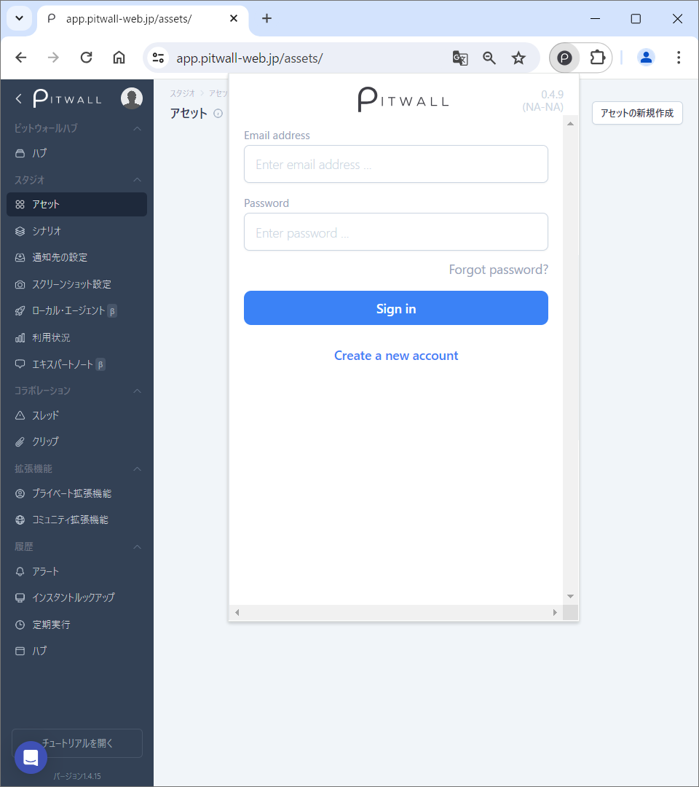
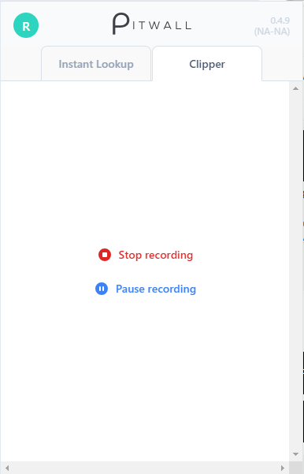
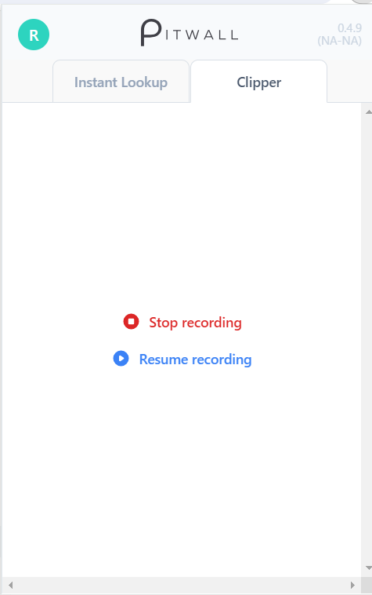

# ブラウザ拡張機能

現在、Chrome拡張機能はパッケージとしてプライベートに提供されています。

## パッケージ及びインストール方法
最新のChrome拡張機能は[ここから](https://chromewebstore.google.com/detail/pitwall/gcnpdohiennomecakkoncdjnkhaonfpm?hl=ja)入手できます。 
インストール方法は[ここ](install.md)を参照ください。

## ブラウザ拡張機能の起動方法
ブラウザ拡張機能がブックマークバーにピン留めされている場合、右上の  アイコンをクリックしてください。初期に起動する場合はログインが必要です。

<figure></figure>

## ブラウザ拡張機能の主な機能
Chrome拡張機能は「Instant lookup」と「Clipper」の２つ機能があります。

<figure></figure>

### Instant Lookup
ブラウザー拡張機能のインスタントルックアップを利用し、シナリオのルックアップに設定されているURLを表示することができます。

- 利用方法
  - 右上の  アイコン > Instant lookup を選択します。Scenario のプルダウンからシナリオを選択します。Lookup のプルダウンからルックアップを選択します。選び終わりましたら、Take screenshot ボタンをクリックして、シナリオのルックアップに設定されている "Asset" のURLのスクリーンショットがシナリオに設定されている通知先に通知メッセージが送信されます。 
  Find ボタンをクリックするとシナリオのルックアップに設定されている "Asset" のURLが表示されます。

### Clipper
Clipperには[Take screenshot]と[Start recording]の２つの機能があります。

#### Take screenshot
スクリーンショットを撮る時に使います。

スクリーンショットを撮るためのオプションはChromeタブ、ウィンドウ、画面全体の３種類あります。 
Chromeタブ：Chromeブラウザで開いている複数のタブからスクリーンショットを撮りたいタブを選択できます。 
ウィンドウ：開いている複数のウィンドウからスクリーンショットを撮りたいウィンドウを選択できます。 
画面全体：画面全体を撮りたい場合に利用するオプションです。

- 利用方法
  - 右上の  アイコン > Clipper > Take screenshot を選択します。 
  Chromeタブ、ウィンドウ、画面全体の３種類のオプションから撮りたい個所のスクリーンショットを選びます。 
  選び終わりましたら共有ボタンをクリックします。
  - Clip name、Destination thread、Destination tabを記入して Save ボタンをクリックします。上記で記入したところにスクリーンショットが表示されます。 
  <figure></figure> 

  | 項目 | 説明 |
  | - | - |
  | Clip name | スクリーンショットの名前を指定します。 |
  | Destination thread | 表示するスレッドの名前を指定します。 |
  | Destination tab | 表示するスレッドのタブを指定します。新しいタブも指定できます。 |

#### Start recording
画面操作をしながら動画を撮る時に使います。実際の画面操作を簡単に共有することができます。

- 利用方法：
  - 右上の  アイコン > Clipper > Start recording を選択します。Chromeタブ, ウィンドウ, 画面全体 の３種類のオプションから撮りたい箇所のビデオを選びます。選び終わりましたら"共有"ボタンをクリックして、録画が開始します。
  - 録画の一時停止及び完了時は、右上の  アイコンをクリック > Clipperタブを選択 > 以下の一時停止[Pause recording]・完了[Stop recording]ボタンを押下します。
  <figure></figure> 

  - 録画の再開時は  アイコンをクリック > Clipperタブを選択 > 以下の動画再生[Resume recording]ボタンを押下します。
  <figure></figure> 

  - Clip name, Destination thread, Destination tabを記入してSaveボタンをクリックすることで、動画が保存されます。 
  <figure></figure> 

  | 項目 | 説明 |
  | - | - | 
  | Clip name | 録画したビデオの名前を指定します。 | 
  | Destination thread | 保存先スレッドの名前を指定します。 | 
  | Destination tab | 保存先スレッドのタブを指定します。新しいタブも指定できます。 | 