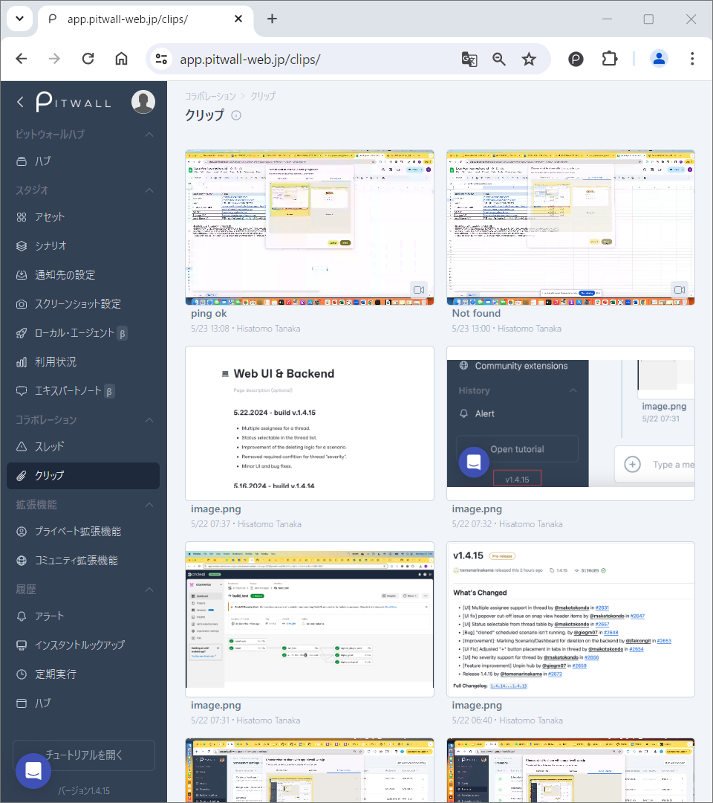
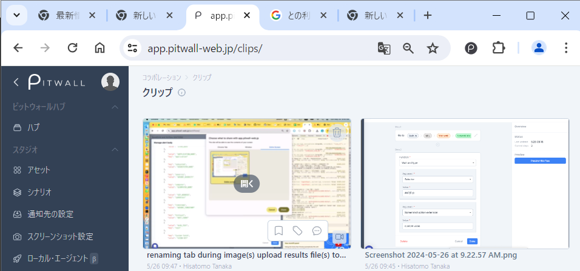

# クリップとは
シナリオやブラウザの拡張機能を使って撮影したスクリーンショットと動画はクリップに蓄積され、表示されます。

<figure></figure>

リストされているスクリーンショットまたは動画にマウスオーバーすることで、タグを付けたり、コメントを追加したりすることができます。

<figure></figure>

## スクリーンショットの場合
-  : スクリーンショットを開いた後、次の操作を行うことができます。

| 項目 | 説明 | 
| - | - | 
| ピン  | スクリーンショットをピン付けすることができます。 |
| タグを追加する  | スクリーンショットにタグをつけることができます。 |
| コメント  | スクリーンショットにコメントを記入することができます。 |
| 注釈をつける  | スクリーンショットに文字を入力したり、画を描くことができます。 |
| 注釈を非表示  | 追加した注釈を非表示化します。 |
| 共有リンク  | クリックすることで、該当スクリーンショットの共有リンクをコピーできます。 |
|  | スクリーンショットを拡大したり、縮小したりすることができます。 |

- ：スクリーンショットを削除します。スレッド内に投稿されているスクリーンショットは削除することができません。削除したい場合は、スレッド内の対象スクリーンショットを削除してから、クリップビュー内のスクリーンショットを削除してください。

## 動画の場合
-  : 動画を開いた後、動画の再生を行うことができます。
- ：動画を削除します。スレッド内に投稿されている動画は削除することができません。削除したい場合は、スレッド内の対象動画を削除してから、クリップビュー内の動画を削除してください。

