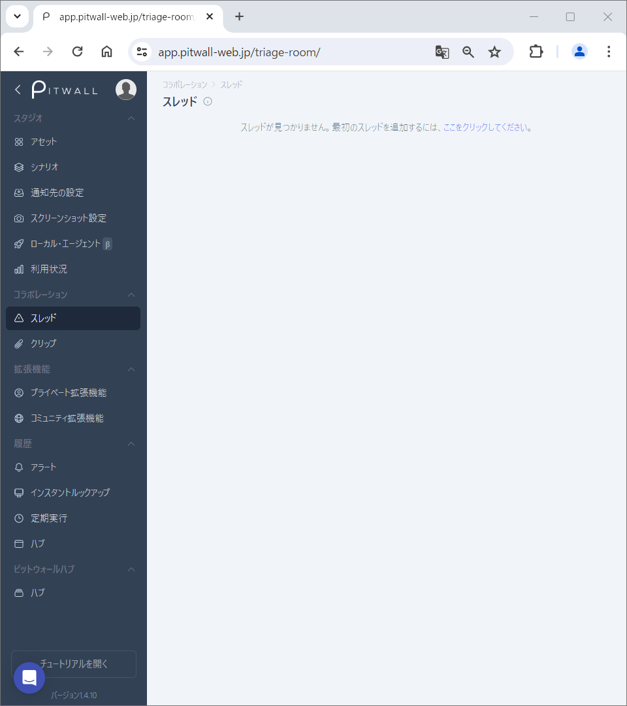
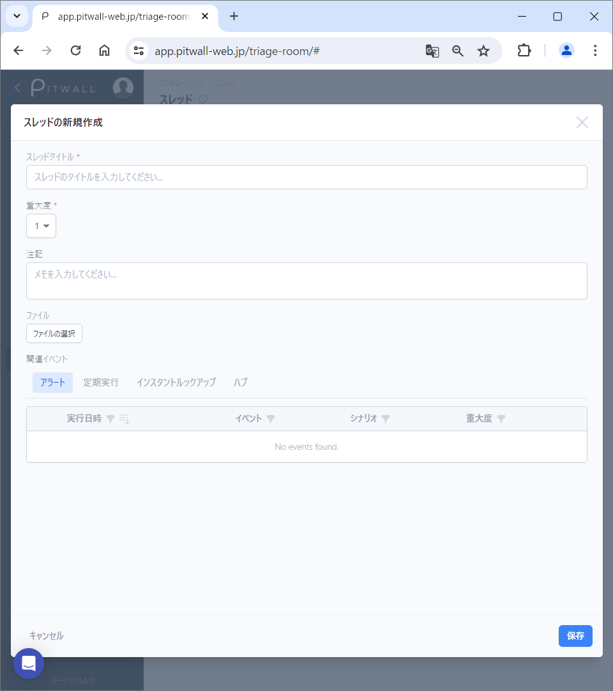
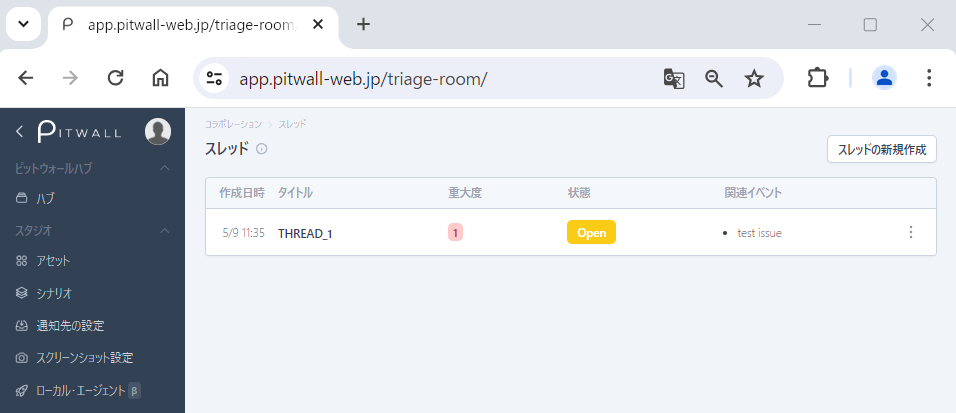

# スレッド

## スレッド機能
スレッドの機能はチームのイベント対応においてさまざまな目的に役立ちます。
主にチームメンバー間のコミュニケーションと調整を促進するために設計されています。

以下はスレッドの一般的な機能になります。
- リアルタイムコミュニケーション：スレッドを使用すると、特定イベントの対応に対してチームメンバーが瞬時にコミュニケーションができるようになります。 
- 情報共有：チームメンバーは、スレッドを使用して最新情報の確認など情報を共有できます。
- 対応方法の調整：関連情報にアクセスして、情報に基づいた対応方針など調整を行うことができます。

### スレッドの新規作成
初期画面はこのような画面になります。

<figure></figure>

スレッドの作成には二つのパターンがあります。

#### パターン１
モーダル画面の 「スレッドの新規作成」からスレッド情報を登録します。

<figure></figure>

- スレッドタイトル：任意のスレッドタイトルを入力します。
- 重大度:重大度に応じて１から６の数を選択できます。１が最も重大で６が最も重大ではないです。
- 注記：メモ欄として使用してください。
- ファイル：ローカルファイルや写真等をアタッチすることができます。
- 関連イベント：関連付けられるイベントは以下の四つがあります。
    - アラート
    - 定期実行
    - インスタントルックアップ
    - ハブ

「保存」ボタンをクリックします。

スレッドを登録すると以下のような画面になります。

<figure></figure>

#### パターン２
PITWALLから通知されるメールより「Create a thread」をクリックすることで、モーダル画面の 「スレッドの新規作成」が表示され、スレッド情報を登録できます。
デフォルトで通知されたメールの関連イベントが紐付けられます。

### スレッド詳細画面の操作方法
スレッドのメイン画面に登録されているスレッドのタイトルをクリックして、スレッドの中身を確認できます。以下はスレッドの詳細画面から操作できます。
- 左上「New tab歯車マーク」または「＋」サインにて新しいタブの追加ができます。
- 下のメッセージ欄の左「＋」サインにて新しいクリップとイベントとファイルを追加することができます。
- 下のメッセージ欄にメッセージを追加することができます。
- 右上「Events」をクリックして、関連付けられているイベントのリストを確認することができます。
    - 関連付けられているイベント名をクリックすると、そのイベントの詳細情報を確認することができます。
- 右上「Clips」をクリックして、スレッドに添付されている画像、動画、ファイルなどを確認することができます。
- 右上「History」をクリックして、スレッドの履歴を確認することができます。

### スレッドの編集・削除・クローズ方法
> スレッドメイン画面の右サイドの三点リーダ  より、スレッドの以下の属性の値を変更することができます。※スレッドの詳細画面の右サイドの三点リーダ  および画面右上の「スレッドを編集する」からも編集することができます。
- タイトル：スレッドのタイトルを編集できます。
- 重大度： スレッドの重大度を編集できます。（１：最も重大、６：最も重大ではない）
- 状態：スレッドの状態（オープン、クローズ、RCA、RCA完了）を編集できます。※スレッド詳細画面の左上のプルダウンメニューからも編集可能です。
- 注記：追加のコメントを入力できます。
> スレッドメイン画面の右サイドの三点リーダ  より、スレッドの削除することができます。

### スレッドのタイムラインの登録・編集方法
スレッドのメイン画面から対象のスレッドをクリック。画面下のスレッドのメッセージ欄にてスレッドにメッセージを追加できます。追加したメッセージにマウスオーバーすると以下のアイコンが出てきます。

- 「コメントの編集」にてコメントの編集ができます。
- 「クリップを追加する」にて画像や動画などの追加ができます。
- 「イベントを選択する」にてイベントの追加ができます。
- 「ファイルのアップロード」にてファイルのアップロードができます。
- 「タイムラインの削除」にてタイムラインの削除ができます。必ず削除したいタイムラインを選択してから削除アイコンをクリックしてください。

メッセージ欄の左の「＋」ボタンを押すことで、「クリップを追加する」、「イベントを追加する」、「ファイルをアップロードする」操作ができます。
