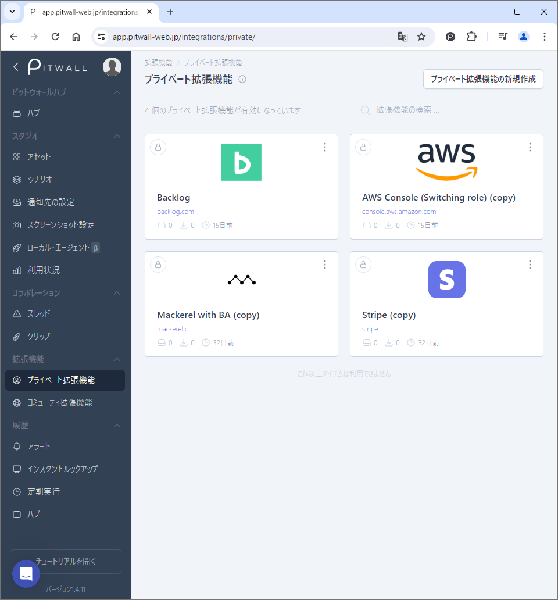
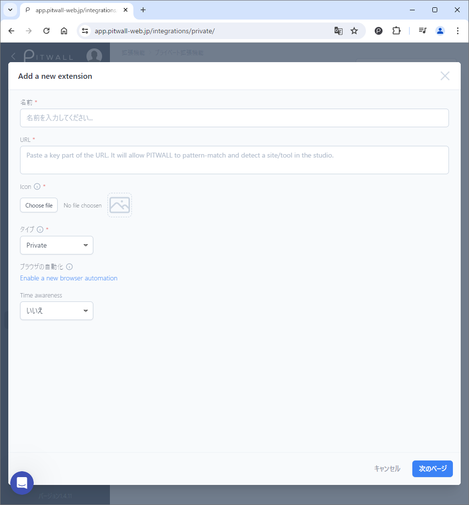

# プライベート拡張機能

プライベート拡張機能とは、アセットで利用するWebサービスについて、以下の情報を登録することができます。

1. Webサービスアイコンを追加してスタジオのUIを充実させます。
2. スタジオでパラメータ化するURL からタイムスタンプを検出するための時間形式を追加します。
<figure></figure>

## プライベート拡張機能の登録

初期画面の右上の「プライベート拡張機能の新規作成」をクリックします。

<figure></figure>

Add a new extension画面から、以下の項目を登録します。

| 項目               | 説明  |
|---                 | --   |
|名前                |機能拡張を識別するための任意の名前を登録します。|
|URL                 |対象のWebサービスのURLを登録します。 ● これは、アセットを登録する際に対象のWebサービスを識別するために利用されます。|
|アイコン            |対象Webサービスのアイコン画像をアップロードします。 ● アイコン画像で利用可能なフォーマットは、jpeg, png, icoが利用可能です。|
|タイプ              |プライベートかコミュニティを選択できます。 ● プライベートを選んだ場合、ユーザテナント内でのみ使用することができます。 ● コミュニティを選択した場合、コミュニティ拡張機能へも登録されます。これにより、同じ情報をPITWALLユーザが利用できるようになり、PITWALLコミュニティへ貢献することが可能です。プライベート機能拡張上から削除するとコミュニティ拡張機能からも削除されます。|
|ブラウザの自動化    |ブラウザの自動化を使用して、対象Webサービス専用のスクリーンショットフローを新規作成し、フローをテンプレート化することができます。|
|時間変換オプション  |「はい」か「いいえ」を選択できます。 ● 「はい」を選択した場合、パラメータ化するURLからタイムスタンプ情報を検出するための時間形式を追加することが可能です。 ● タイムスタンプ情報は、fromとtoのタイムスタンプ形式をISO形式 または、UNIX形式から選択し、テキストボックスへ正規表現にて値を記述します。|
|削除                |対象の拡張機能が不要となった場合、削除をすることが出来ます。|
