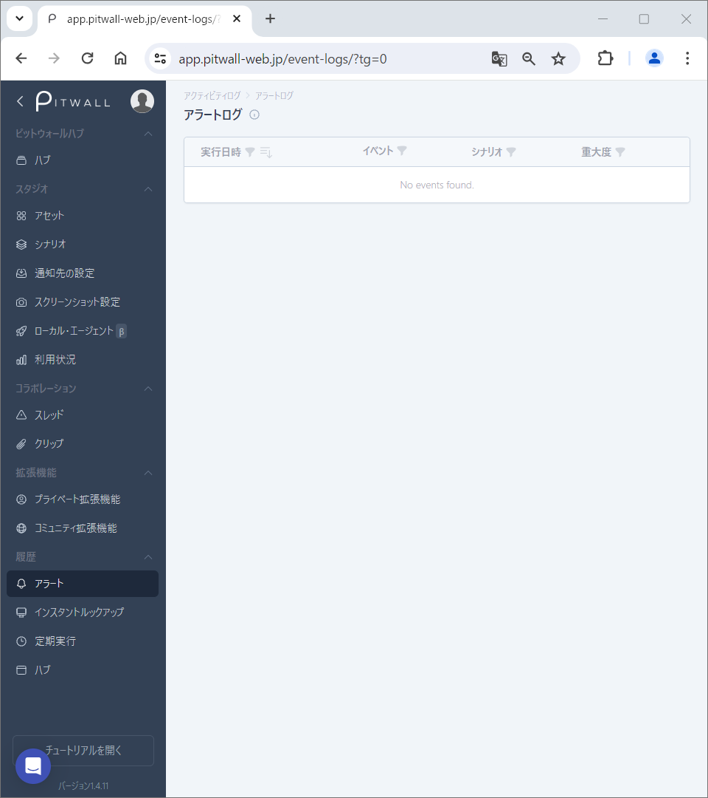
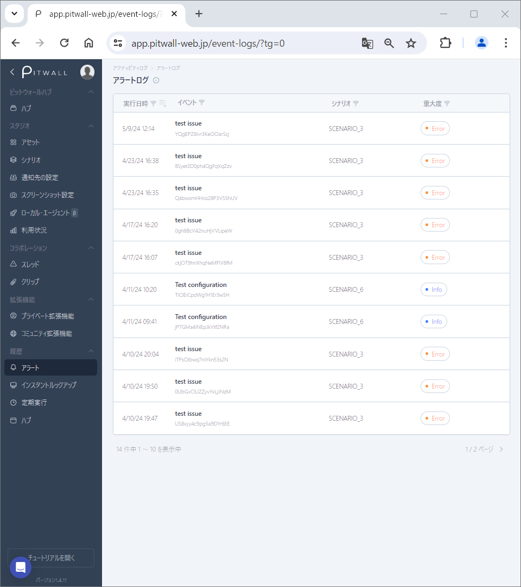
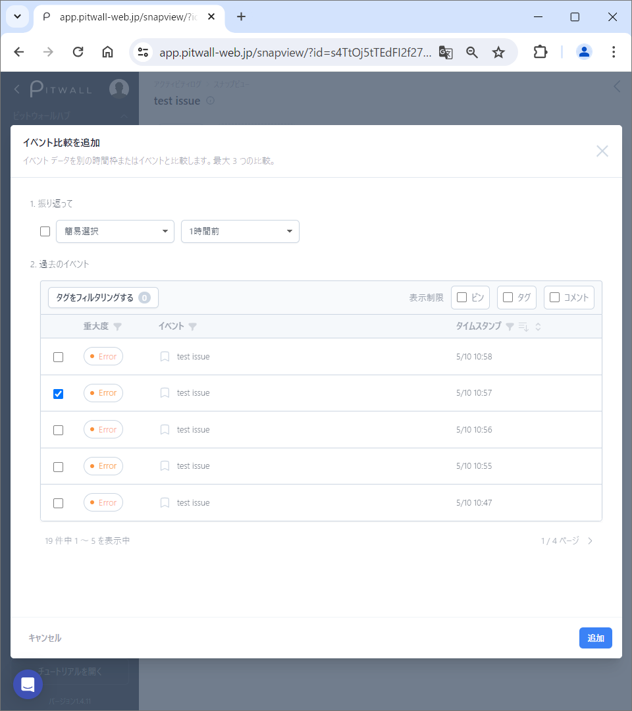
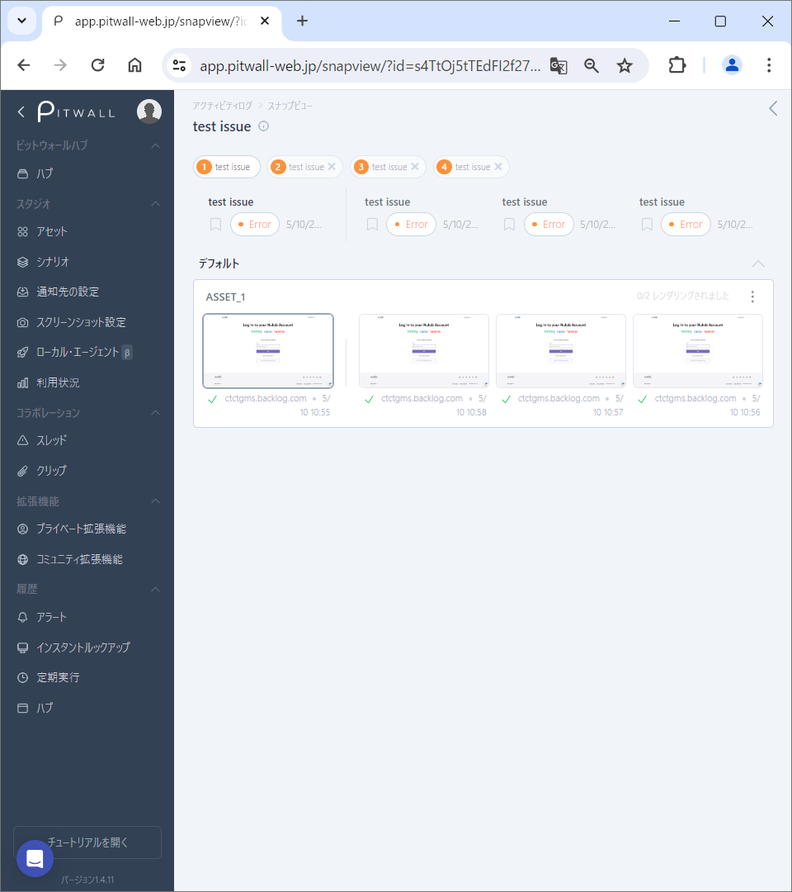

# アラート

## アラートログ
アラートシナリオの実行履歴を見ることができます。主な使用用途は
アラートに関する詳細情報の閲覧、取得された情報を比較、
そして、アラートの情報にタグ、コメント、注釈を追加することができます。
詳細な分析を行うことができ、アラートの詳細画面では、対象アラートとは
別に３つまでアラート情報を選択して比較する事ができます。

## 使用方法
初期画面はこのような画面になります。

<figure></figure>

### アラートの履歴画面
アラートが発報され、履歴に残るとこのような画面になります。

<figure></figure>

- 実行日時:アラートが実行された日時が表示されます。
  -  アイコンをクリックする事で表示したい実行日時を日付でフィルターする事ができます。
    - Fromにフィルターしたい実行日時の開始日時、Toにフィルターしたい実行日時の終了日時を入力して「検索」をクリック。※カレンダーアイコンから日時を選択し、入力することも可能です。
  -  アイコンをクリックする事で、実行日時の表示順番を新しいものから古いもの、古いものから新しいものへと並び変えることができます。
- イベント:実行されたイベント名が表示されます。
  -  アイコンをクリックする事で、イベントタイトルからアラートを検索することができます。
    - 検索ボックスへ任意のキーワードを入力し、「検索」をクリック。
- シナリオ:実行されたシナリオ名が表示されます。
  -  アイコンをクリックすることで、シナリオ名でシナリオを検索することができます。
      - 検索ボックスへ任意のキーワードを入力し、「検索」をクリック。
- 重大度:アラートの重大度が表示されます。
  -  アイコンをクリックすることで、イベントの重大度でアラートを検索することができます。
      - アラートの重大度(All、Critical、Error、Warning、Info、Debug)を選択し、「検索」をクリック。

### アラートログの比較画面

特定のアラートログの比較初期画面はこのような画面になります。

<figure></figure>

アラートログのデータを別の時間枠またはアラート情報と比較することができます。
「比較対象を追加」をクリックすることで、比較対象の履歴を追加することが可能です。(最大4つまで表示させることが出来ます。
比較対象の追加は３つまで。)比較対象を削除するには削除したい比較対象の右サイドの×ボタン
をクリックします。

### 比較対象履歴の新規追加
モーダル画面の 「比較対象を追加」からアラート情報を追加します。
最大3つまで比較対象を追加できます。

<figure></figure>

- 振り返って:過去の日時から追加する比較対象のデータを指定します。
  - 簡易選択:以下の時間から比較する過去の期間を選択します。
    - １時間前
    - １日前
    - １週間前
    - １か月前

  - 日時:比較対象の日時指定します。<!--試したが、動きがよくわからない&怪しいため、要確認) -->

- 過去のイベント:リストから過去のイベントを選択します。(重大度、イベント、タイムスタンプでフィルター可能です。)
  - フィルターの利用方法
    - 重大度:アラートの重大度が表示されます。
      アイコンをクリックすることで、イベントの重大度でフィルターすることができます。
      アラートの重大度(All、Critical、Error、Warning、Info、Debug)をクリック。
    - イベント:イベントタイトルが表示されます。
      アイコンをクリックすることで、イベントのタイトルで検索することができます。
    - タイムスタンプ:
      アイコンをクリックする事で表示したい日付でフィルターする事ができます。
    　- Fromにフィルターしたい実行日時の開始日時、Toにフィルターしたい実行日時の終了日時を入力して「検索」をクリック。※カレンダーアイコンから日時を選択し、入力することも可能です。
       アイコンをクリックする事で、実行日時の表示順番を新しいものから古いもの、古いものから新しいものへと並び変えることができます。

### 比較対象を追加後の画面
比較対象を追加するとこのような画面になります。

<figure></figure>

### アラート情報へのタグ、コメント、注釈、ピンの付け方
アラートタイトルへマウスオーバーすると、ピン、タグ、コメントを追加することができます。
キャプチャー情報へマウスオーバーすると、ピン、タグ、コメント、注釈を追加することができます。
更にスクリーンショット更新する、展開ビューを開く、注釈エディターを開く、URLにアクセスを
することができます。

