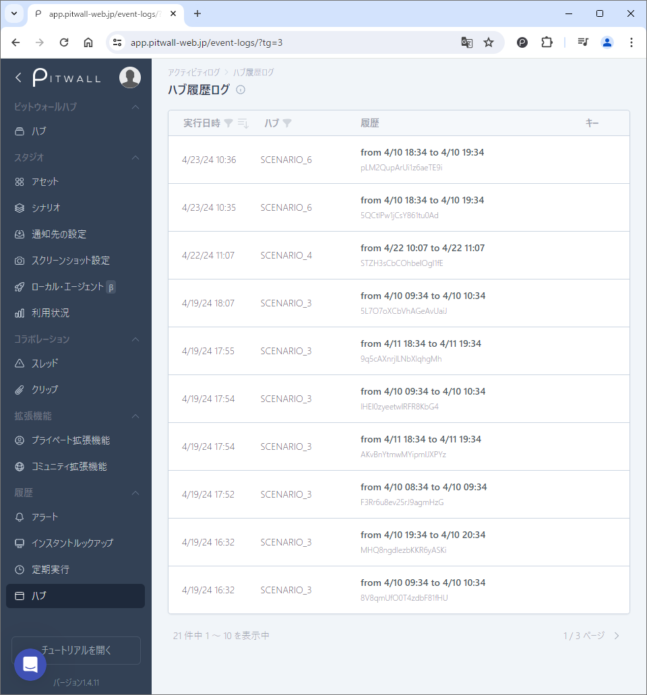

# ハブ
<figure></figure>

## ハブ履歴ログ  
この詳細ビューでは、過去に作成されたダッシュボードを振り返り、イベントを比較、タグ、コメント、注釈を追加し、詳細な分析を行うことができます。記録されているハブ行の「履歴」をクリックすることで、作成されたダッシュボードを閲覧することができます。
- 実行時間：実行された時間が表示されます。
- ハブ：ダッシュボードグループ名が表示されます。
- 履歴：ダッシュボードが作成された日時や期間が表示されます。
- キー：使用されたキーが表示されます。