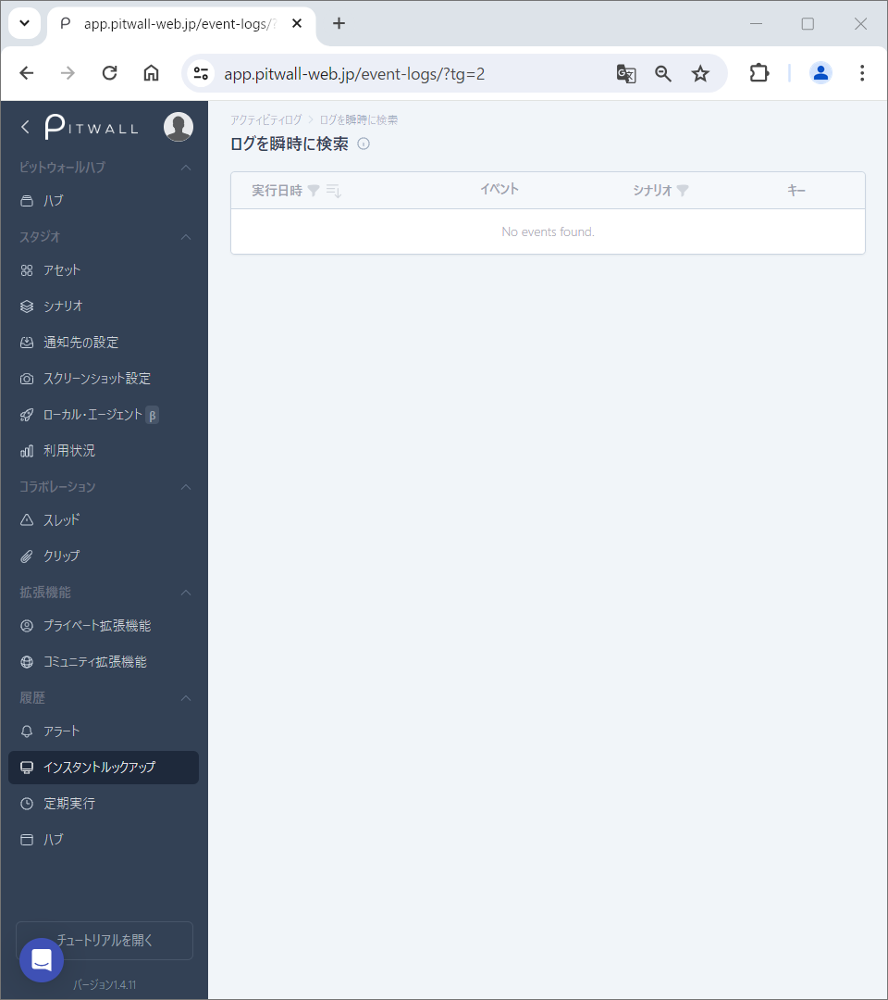
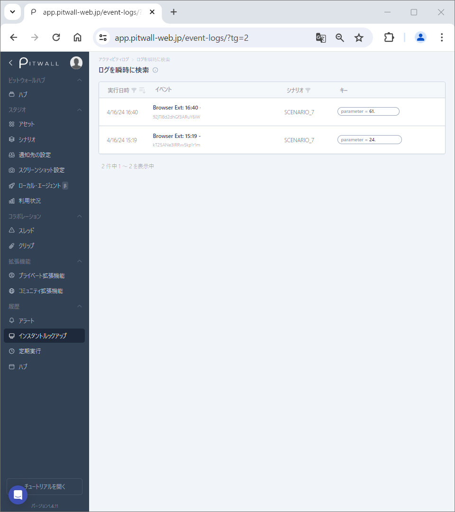

# インスタントルックアップログ

## インスタントルックアップログとは
インスタントルックアップログには、インスタントルックアップの実行結果が含まれており、様々な目的で取得したデータを簡単に閲覧することができます。実行されたイベントの日時が保存され、リストアップされるため、特定期間のイベント情報を確認する必要がある場合に非常に役立ちます。
また、一つの画面に特定期間の複数の過去イベントを追加する機能も備えており、情報の比較に便利です。

### インスタントルックアップログの使用方法

初期画面はこのような画面になります。

<figure></figure>

実行されたインスタントルックアップの履歴がこのようにリストアップされます。

<figure></figure>

| 項目 | 説明 |
| - | - |
| 実行日時 | インスタントルックアップの実行日時。 |
| イベント | 実行されたインスタントルックアップイベント情報。 |
| シナリオ | インスタントルックアップが追加されているシナリオの名前。 |
| キー | URLやツールへアクセスする際に必要とするキーの値になります。 |

左上  をクリックして、日付でフィルタリングすることができます。
左上  をクリックして、日付順（古いものから新しいもの）に表示することができます。

### インスタントルックアップイベント情報の確認方法
インスタントルックアップログ画面で、リストアップされている実行日時またはイベントをクリックして、イベントの詳細情報を確認できます。
複数イベント情報を比較する場合に、左上の「比較対象を追加」にて対象イベントを追加することができます。

### 複数の過去イベントを比較するには
イベントの詳細情報を表示した上で、「＋比較の追加」をクリックして比較したい過去イベントを選んで追加します。
複数イベント情報は同じ画面に横並びになるため、情報の比較に便利です。

