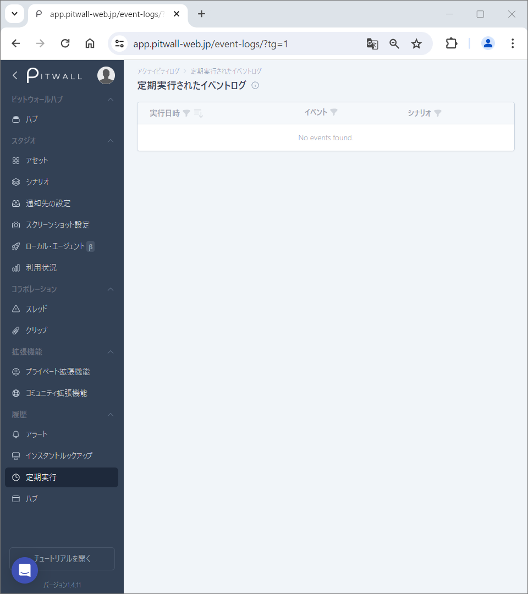
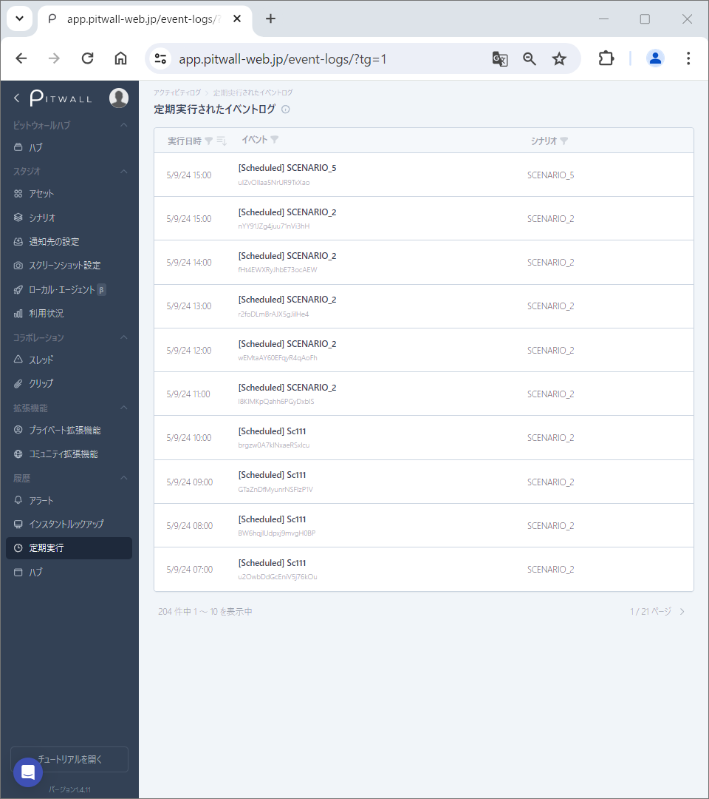
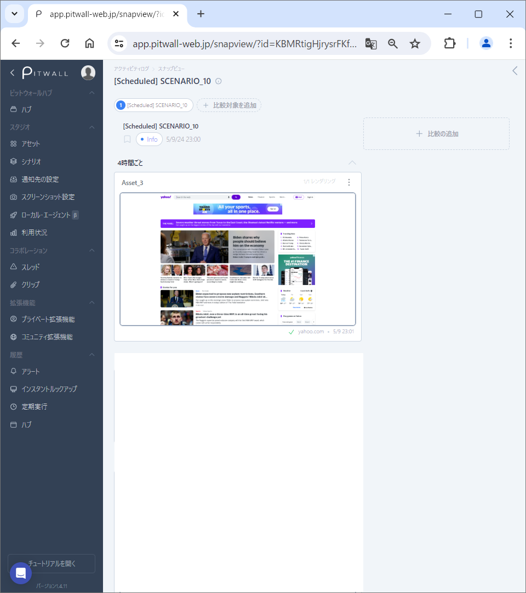
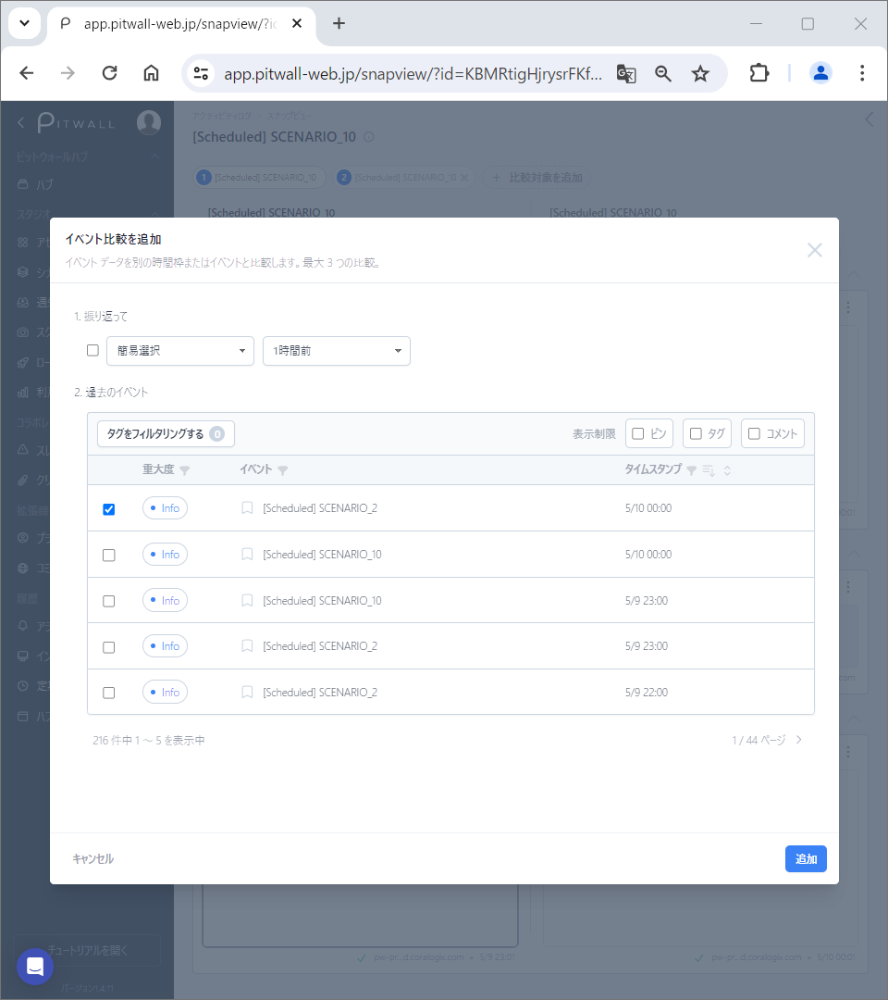
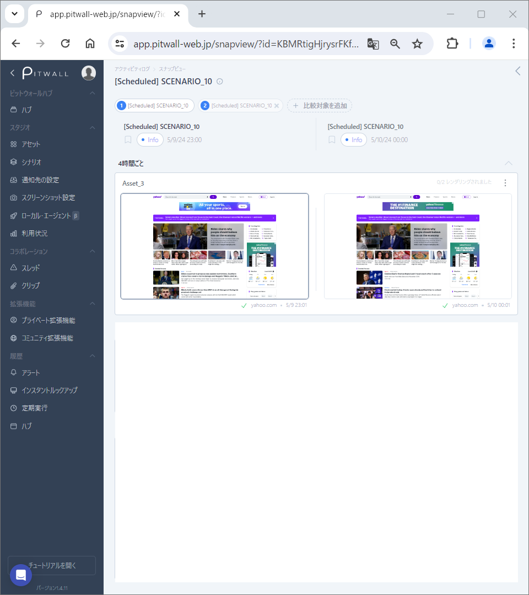

# 定期実行

## 定期実行されたイベントログ
実行されたイベントの履歴を見ることができます。この詳細ビューでは、イベントを比較し、タグ、コメント、注釈を追加し、詳細な分析を行うことができます。

## 使用方法
初期画面はこのような画面になります。

<figure></figure>

### 定期実行されたイベントログの画面
イベントが実行され、履歴に残るとこのような画面になります。

<figure></figure>

- 実行日時:イベントが実行された日時が表示されます。
  - <picture></picture>アイコンをクリックする事で表示したい実行日時を日付でフィルターする事ができます。
    - Fromにフィルターしたい実行日時の開始日時、Toにフィルターしたい実行日時の終了日時を入力して「検索」をクリック。※カレンダーアイコンから日時を選択し、入力することも可能です。
  - <picture></picture>アイコンをクリックする事で、実行日時の表示順番を新しいものから古いもの、古いものから新しいものへと並び変えることができます。
- イベント:実行されたイベント名が表示されます。
  - <picture></picture>アイコンをクリックする事で、イベントタイトルからイベントを検索することができます。
    - 検索ボックスへ任意のキーワードを入力し、「検索」をクリック。
- シナリオ:実行されたシナリオ名が表示されます。
  - <picture></picture>アイコンをクリックすることで、シナリオ名でシナリオを検索することができます。
      - 検索ボックスへ任意のキーワードを入力し、「検索」をクリック。
  
### 定期実行されたイベントログ履歴の比較画面

初期画面はこのような画面になります。

<figure></figure>

イベントデータを別の時間枠またはイベントと比較することができます。「比較対象を追加」または「比較の追加」をクリックすることで、比較対象の履歴を追加することが可能です。(最大4つまで表示させることが出来ます。比較対象の追加は３つまで。)

#### 比較対象履歴の新規追加
モーダル画面の 「比較対象を追加」から通知先情報を追加します。最大3つまで比較対象を追加できます。

<figure></figure>

- 振り返って:過去の日時から追加する比較対象のデータを指定します。※各スクリーンショットはリアルタイムでキャプチャされるため、数分かかる場合があります。
  - 簡易選択:以下の時間から比較する過去の期間を選択します。
    - １時間前
    - １日前
    - １週間前
    - １か月前

  - 日時:比較対象の日時指定します。(試したが、動きがよくわからないため、要確認)

### 比較対象を追加後の画面
比較対象を追加するとこのような画面になります。

<figure></figure>

- 通知先:通知先名が表示されます。
- シナリオ:通知先が使われているシナリオの数です。
- 登録日時:通知先を登録した日時です。
- 最終更新日時:通知先を最後に更新した日時です。

- デフォルト: 取得されたスクリーンショットが表示されます。右の矢印をクリックすることでスクリーンショット表示を折りたたんだり、展開させることが可能です。
