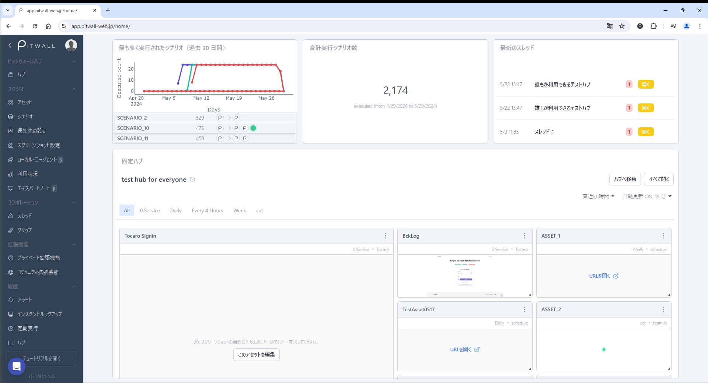

# ホーム
ログインした直後に表示されるページです。ダッシュボードのような形式で、以下の情報が確認できます。

<figure></figure>

| 項目                        | 説明   |
| :-                          | :-     |
|最も多く実行されたシナリオ   |過去３０日間で実行されたシナリオと、その実行回数と実行日がグラフ化されています。 　縦軸が実行された回数で、横軸が実行された日付です。グラフの直下には実行されたシナリオ名と実行された回数が表示されています。|
|合計実行シナリオ数           |登録されているシナリオが実行された合計回数が表示されます。|
|最近のスレッド               |直近で作成されたスレッドが表示されます。|
|固定ハブ                     |ハブのページでピン留めされているハブがホームに固定表示されます。 　ハブへ移動：ハブページへ移動します。 　すべて開く：対象のハブに登録されているアセットを全てブラウザの別タブで開きます。 ハブ機能の詳細は[ハブ](tutorial-get-started/pitwall-hub/pitwall-hub.md)ページを参照してください。|