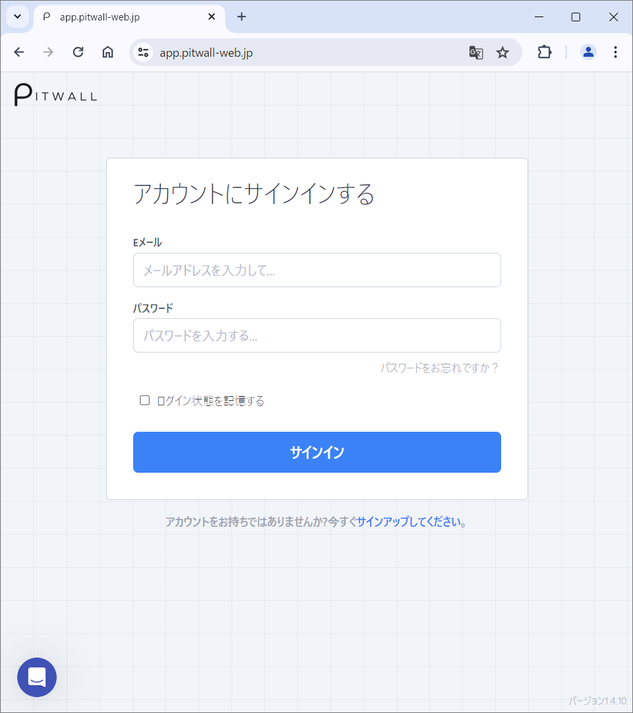

# ログイン / ログアウト
## ログインをする
ブラウザーからPITWALLのURL [https://app.pitwall-web.jp/](https://app.pitwall-web.jp/) へアクセスします。

<figure></figure>

「アカウントにサインインする」画面からE-mailアドレスと、パスワードを入力して「サインイン」をクリックします。ログイン後に「Scenario」ページに遷移すればログインが成功です。
  - 「ログイン状態を記憶する」にチェックを入れることで、次回からE-mailアドレスの入力を省略することができます。

２要素認証を有効化している場合は、認証コードがSMSまたはE-mailで送付されます。送付されてきた認証コードを入力してください。認証コードが送られてこない場合は「Resend a new code」で認証コードを再発行が可能です。

パスワードを忘れてしまった場合は、「アカウントにサインインする」画面の「パスワードをお忘れですか？」からパスワードをリセットすることができます。
  - E-mailアドレスを入力して、「Reset my password」をクリックしてください。リセットするためのリンクがE-mailで送付されます。E-mail内のリンクからパスワードをリセットしてください。

## ログアウトをする
画面左上の人型アイコンをクリックしてください。

<figure></figure>

プルダウンメニューから「ログアウト」をクリックします。「アカウントにサインインする」画面に遷移すれば、ログアウト成功です。