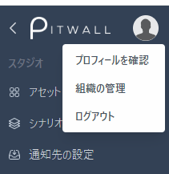
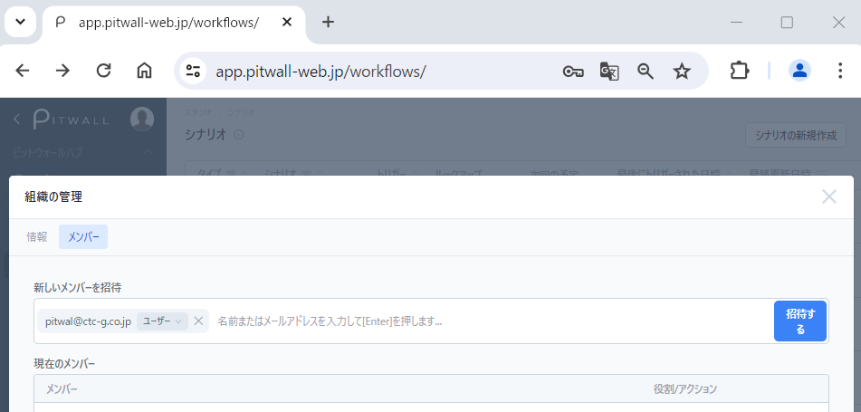

# 組織の管理
組織とは、PITWALLを利用する際に払い出される契約ごとのテナントを指します。
組織の管理では、組織と組織に所属するメンバーを管理することが出来ます。本機能はAdmin権限を持つユーザのみ使用可能です。

## 組織の管理を行う
組織の管理を行うには、画面左上の人型アイコンより「組織の管理」を選択すると「組織の管理」の画面へ遷移します。

<figure></figure>

### 情報
組織名と２要素認証の設定をします。
- 名前：組織名が設定されている場合は、設定されている組織名が表示されます。「名前の変更」をクリックし、任意の組織名を入力することで、組織名を変更できます。入力必須項目となり、未入力のまま保存はできません。
- ２要素認証を有効にする：トグルスイッチをクリックすることで、２要素認証を有効化します。Eメールで設定が可能です。

### メンバー
組織に所属するユーザの管理をします。

新しいメンバーを招待 
PITWALLへユーザを招待します。テキスト入力欄に、Eメールアドレス入力し、タブを押し確定してください。確定すると、権限を選択できます。「管理者」「ユーザー」を選択して、「招待する」をクリックしてください。
  - 同時に複数のメンバーを招待することが可能です。
  - 招待されたメンバーのメールアドレス宛に招待メールが送信されますので、招待メールのリンクからアカウントの登録を実施します。

<figure></figure>

現在のメンバー 
組織に所属しているメンバーの一覧が表示されます。

メンバー：メンバーの名前とメールドレスが表示されます。
  - 青いチェックマークがついているメンバーは組織管理者です。
  - 「Invitation pending」が表示されているユーザは、招待したユーザがPITWALLアカウントを有効化していない状態です。招待メールが未達の場合は、「Resend」をクリックして招待メールを再送することができます。

役割/アクション：ユーザとユーザ権限の管理をします。
  - 「admin」は管理者権限です。プロジェクト内の全ての領域にアクセス、そして組織情報を編集する権限が付与されます。
  - 「user」は一般ユーザです。プロジェクトへの情報の追加、修正、削除する権限が付与されます。
  - 「trasfer ownership」は、組織管理者を別のadminユーザへ譲渡することができます。譲渡先のユーザはadminの役割が付与されている必要があります。
  - 「Remove member」をクリックすると、ユーザを削除することができます。
      