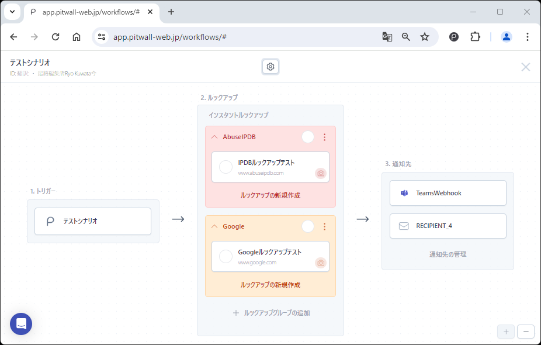
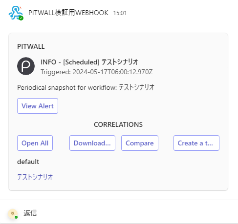
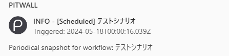
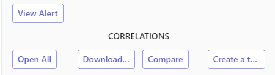
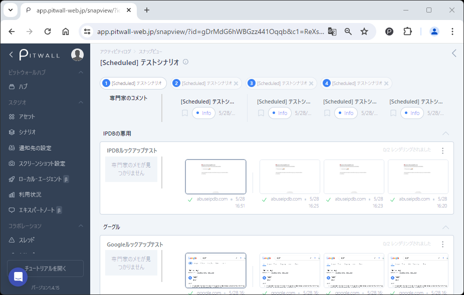
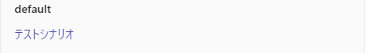

# 通知
シナリオに通知先を設定をすると、シナリオが発動された際に通知が送付されます。通知先の設定については[通知先の設定](./studio/recipient-settings.md)を参照してください。  
通知から様々なアクションを実行することで、素早いアセットの現状把握を支援します。例えば、アセットを過去の状態と比較、スレッドを作成して分析、アセットに設定されているURLへの遷移など、通知からPITWALLの各ページへ遷移することが可能です。通知を受けてから、PITWALLで当該通知の内容を探す手間なども省略できます。通知先によって、通知のレイアウトや表示などが変化しますが、通知コンテンツは原則同じです。

**下記のシナリオ設定を例として、通知内容説明をします。**

<figure></figure>

| 項目             | 説明                    |
| -                | -                       |
| シナリオ名       | テストシナリオ          |
| シナリオタイプ   | 定期実行                | 
| ルックアップ設定 | AbuseIPDBとGoogleを設定 |
| 通知先           | Teamsとメールを設定     |

<!--
|シナリオ                        | 設定内容  |
| -                              | -         |
|<figure></figure> | シナリオ名：テストシナリオ シナリオタイプ：定期実行 ルックアップ設定：AbuseIPDBとGoogleを設定 通知先：Teamsとメールを設定 |
-->

## 通知内容
下記の例は、Webhook機能を利用してTeamsに通知を受領した際のサンプル画面です。
<figure></figure>

### 通知ヘッダー
<figure></figure>

| 項目        | 説明  |
| -           | -     |
|件名         |PITWALLからの通知であること、シナリオタイプ、そしてシナリオ名が記載されます。|
|Triggered    |シナリオが実行された日時。|
|説明         |シナリオタイプ名と実行されたシナリオ名が記載されます。|

### 通知から実行可能なアクション
<figure></figure>

| 項目            | 説明  |
|:---             | :--   |
|View Alert       |シナリオがアラート起因の場合、アラートの履歴ページへ遷移します。|
|Open All         |シナリオに設定されているアセットへジャンプすることができます。|
|Download         |シナリオの設定で取得されたスクリーンショットをダウンロードすることができます。
|Compare          |直近で取得されたスクリーンショット画像と、過去に取得されたスクリーンショット画像を比較する画面へ遷移します。各シナリオの履歴ページから、直近で実行されたシナリオを選択して参照できる情報と同じ情報が、通知からワンクリックで到達できます。例のシナリオの場合は、シナリオタイプが定期実行なので、定期実行の履歴から情報の比較ページへ遷移したときと同じ情報がワンクリックで閲覧できます。  <figure></figure>
|Create a Thread  |直近で取得されたスクリーンショットをもとに、スレッドを作成します。スレッド機能については[スレッド](../tutorial-get-started/collaboration/threads.md)ページを参照してください。|

### ルックアップグループ名とルックアップタイトル名
<figure></figure>
ルックアップタイトル名をクリックすることで、シナリオに登録されているルックアップ対象へジャンプすることができます。スクリーンショット設定で、通知に添付する設定をしている場合は、通知下部にスクリーンショット画像が添付されます。