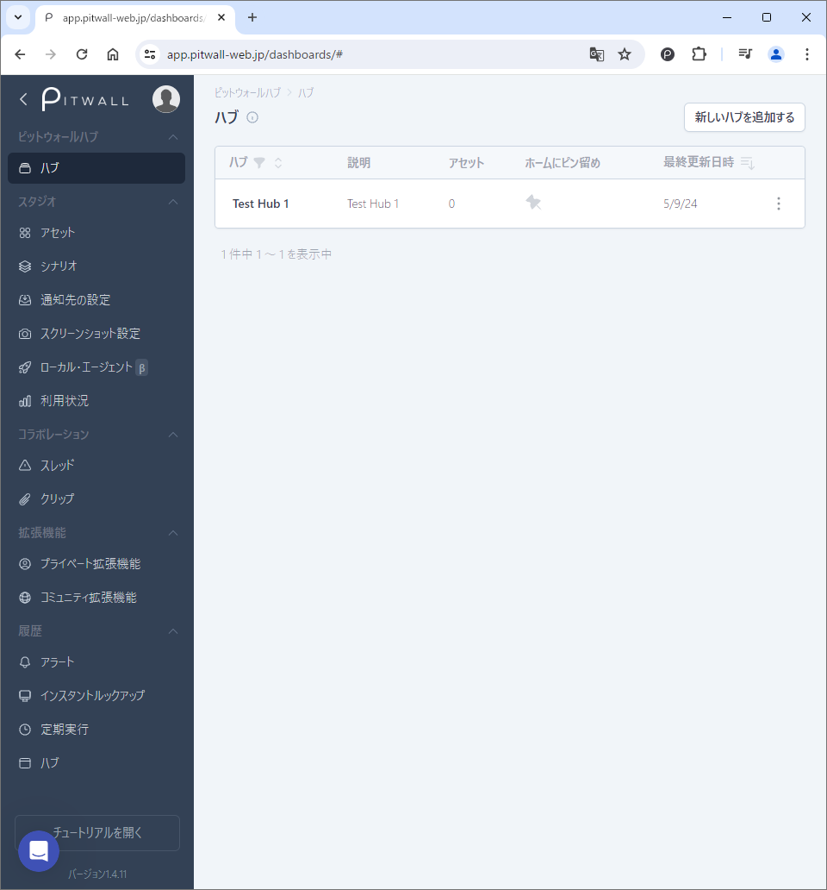
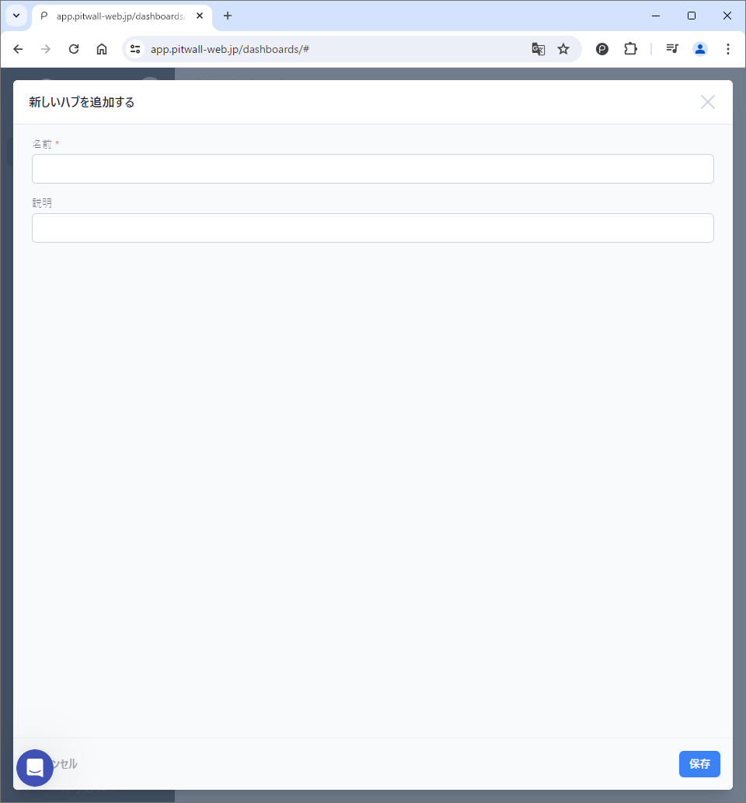
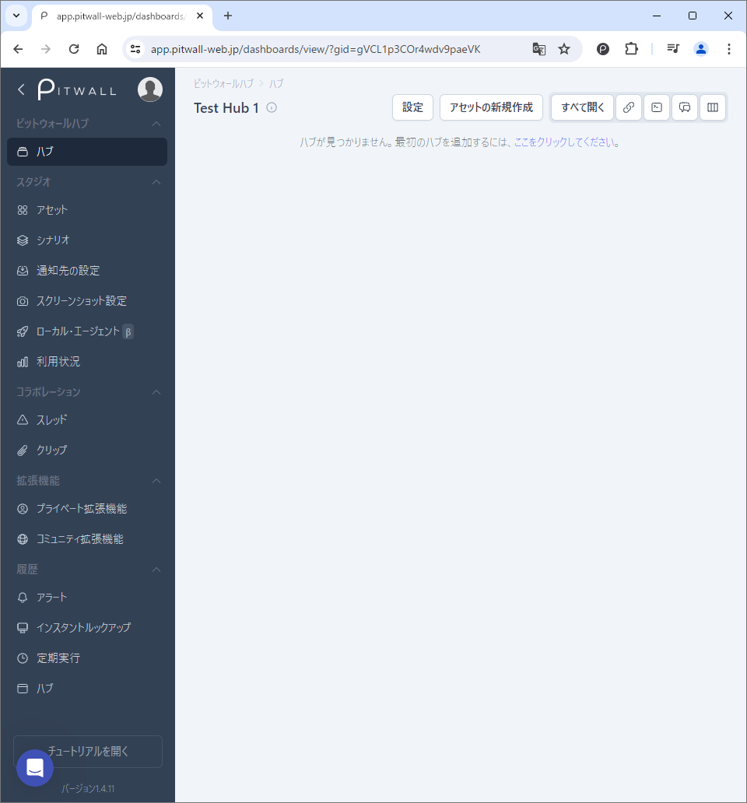

# ハブ
新規ハブの作成、作成済みのハブを閲覧することができます。各グループはアセットをグループ化したものです。アセットをグループへ追加や削除する等、各ハブを管理することができます。グループ化したハブは、マウスでサイズを変更したり、表示レイアウトが簡単に操作できます。

<figure><figcaption></figcaption></figure>

| 項目                     | 説明  |
|:---                      | :--   |
|ハブ                      |ハブの名前が記載されます。グループ名をクリックすると、ハブ設定の編集画面へ遷移します。
| 説明                     |ハブの概要が表示されます。
|アセット                  |ハブに登録してある、アセットの数が表示されます。
|ホームにピン留め          |ハブ画面のページにピン留めすることができます。
|最終更新日時              |ハブの設定が変更された最終日時が表示されます。
|三点リーダ（その他の機能）|● Edit this dashboard group：ハブの設定を変更します。 ● Start dashboard comparison：ハブを使用して、登録されているアセットの分析を開始します。 ● Delete this dashboard group：ハブを削除します。
  

## ハブの新規作成
ハブを新規作成：ボタンをクリックするとハブを作成できます。下記の項目を設定して作成します。詳細の設定は「ハブの編集」へ進みます。<figure><figcaption></figcaption></figure>

| 項目     | 説明  |
|:---      | :--   
|名前      |ハブに名前をつけます。
|説明      |ハブの説明を記入します。

## ハブの編集

<figure></figure>

| 項目                | 説明  |
|:---                 | :--   |
|設定                 |クリックすると「ハブ設定の管理」画面が表示されます。ハブを閲覧するメンバーを選択することができます。|
|アセットの新規作成   |ハブに追加するアセットを登録します。 ● 新規アセットを作成する：新規でアセットを登録する際はこちらを選択します。 ● 既存のアセットを選択：既存のアセットをハブに登録する際は、アセットが持つカテゴリー別にアセットを選択することができます。
|全て開く             |ハブに登録しているアセットの現在の状況をブラウザの別タブで表示することができます。2つ以上アセットが登録されている場合は、ブラウザによってポップアップがブロックされる可能性があります。|
|リンクアイコン|ハブのリンクURLをコピーします。|
|見出しアイコン|ハブに見出しを追加することができます。|
|吹き出しアイコン|ハブからスレッドを作成することができます。|
|レイアウトアイコン|このハブのさまざまなインスタンスを比較することができます。 ● ハブの比較対象を管理：ハブを時間フレーム や Key-Value セットと比較します。下記項目を設定して追加ボタンをクリックします。|

ハブの設定例：
<figure><figcaption></figcaption></figure>

<!--
- 設定：クリックすると「ハブ設定の管理」画面が表示されます。ハブを閲覧するメンバーを選択することができます。
- ハブ一覧から作成したハブ名をクリックして、ハブの編集をします。
    - アセットの編集：ハブに追加するアセットを登録します。
        - 新規アセットを作成する：新規でアセットを登録する際はこちらを選択します。
        - 既存のアセットを選択：既存のアセットをハブに登録する際は、アセットが持つカテゴリー別にアセットを選択することができます。
- アセットの新規作成：ハブに追加するアセットを追加することができます。
- 全て開く：ハブに登録しているアセットの現在の状況をブラウザの別タブで表示することができます。2つ以上アセットが登録されている場合は、ブラウザによってポップアップがブロックされる可能性があります。
- リンクアイコン：ハブのリンクURLをコピーします。
- 見出しアイコン：ハブに見出しを追加することができます。
- 吹き出しアイコン：ハブからスレッドを作成することができます。
- レイアウトアイコン：このハブのさまざまなインスタンスを比較することができます。
    - ハブの比較対象を管理：ハブを時間フレーム や Key-Value セットと比較します。下記項目を設定して追加ボタンをクリックします。
        - 日時範囲：比較する日時範囲を選択します。
        - 別の日範囲を追加：追加で日時範囲を指定することができます。
        - プレビュー：設定内容のレイアウトプレビューが表示されます。ハブの比較は最大４つの切り替え可能な列で表示されます
-->

## ハブのレイアウト変更
ハブ編集して、表示させる情報を設定後、各アセットはマウスで表示を拡張したり、配置を変更することができます。<!--動画を入れたい-->



<video width="320" height="240" controls>
  <source src="https://github.com/pitwall-dev/pitwall-docs-ja/blob/main/.gitbook/assets/Hub_Layout_Sample.mp4" type="video/mp4">
</video>

