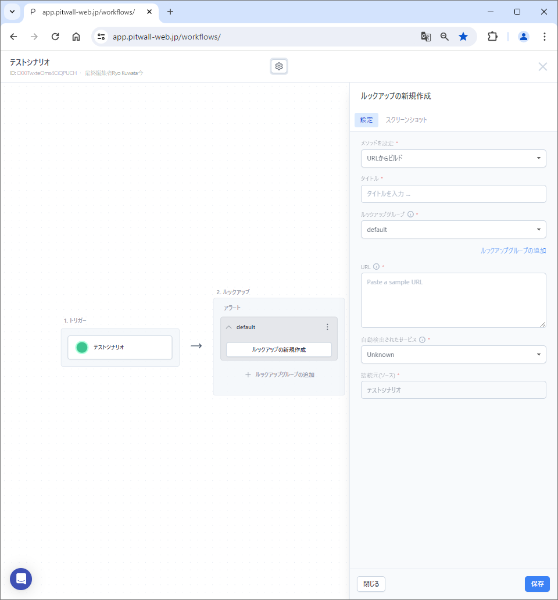

# アラートシナリオ
アラートを起因とするサイトやツールの分析をします。
「シナリオの新規作成」ボタンから、シナリオ名、概要、シナリオタイプを選択して保存した後に、下記の要素を設定してください。  以下の手順は、「ゼロから構築」を選択した場合のシナリオ作成手順です。
<figure></figure>

## トリガー設定
「トリガーを設定」ボタンをクリックし、シナリオが実行されるトリガー（きっかけ）を定義します。設定項目の入力が終了したら、保存ボタンをクリックします。<figure></figure>

| 項目                     | 説明  |
|:---                     | :--   |
|タイトル                  |任意のトリガータイトルを入力します。|
|タイプ　　　　            |アラートを選択します。|
|サービスのソースを選択    |アラート送信元のサービスを選択します。|
|Alert Body                |トリガーとなるサービスを選択すると、アラートボディのサンプルが表示されます。表示されたアラートボディにマウスオーバーすると、アラートボディを編集することができます。 ● Alert Bodyの編集：アラート送信されるペイロードがカスタマイズされている場合は、Alert Bodyを編集することができます。|
|カスタムキーの追加        |デフォルトのAlert Bodyにあるパラメータをカスタムし、追加することができます。詳細は下記の手順を参照してください。|

### カスタムキーの追加
カスタムキーの追加：ボタンをクリックすると下記のようなモーダル画面が表示されます。<figure></figure>
#### 1.- 設定
| 項目                          | 説明  |
|:---                           | :--   |
|キー名                         |カスタムキーに名前を付けます。全てのカスタムキーの名前には「pw_custom_」という文字列がプレフィックスとして追加されます。
|解析対象を選択                 |カスタムキーで解析するペイロードのキーを選択します。|
|正規表現推論のサンプルを追加   |サンプルのペイロードを貼り付け、カスタムキーに対応する値を選択し、「新しい推論サンプルを追加」をクリックして、サンプルを追加します。 <figure></figure>  ●サンプルペイロードを貼り付ける：サンプルペイロードを貼り付けてください。 ●選択した値を抽出：貼り付けたサンプルペイロードからカスタムキーで抽出したい値をハイライトします。「選択した値を抽出」ボタンをクリックすると、目標値に値が表示されます。 ●目標値：抽出ターゲットとなる値が表示されます。 ●サンプルを追加：サンプルペイロードを追加します。

#### 2.-検証
| 項目                                 | 説明  |
|:---                                  | :--   |
|正規表現テストのサンプルを追加する    |新しいテストサンプル追加をクリックして、作成した正規表現を検証します。<figure></figure> ●サンプルペイロードを貼り付ける：サンプルのペイロードを入力します。 ●貼り付けたサンプルペイロードからカスタムキーで抽出したい値をハイライトします。「選択した値を抽出」ボタンをクリックすると、目標値に値が表示されます。 ●目標値：ターゲットとなる値が表示されます。 ●サンプルを追加：サンプルを追加します。|
|正規表現抽出のテスト                  |正規表現による抽出可否を検証します。
|結果                                  |正規表現を適用してテストペイロードから抽出された値を表示します。

## ルックアップ設定
「ルックアップの新規作成」をクリックして、イベント発生時に取得するデータ（ダッシュボード、ツール、コンソール等）を定義します。シナリオの主要な部分です。下記の項目を登録して、保存ボタンをクリックします。<figure></figure>
### 設定
| 項目                     | 説明  |
|:---                      | :--   |
|メソッドを設定           |ルックアップ方法を設定します。ルックアップ対象をアセット登録している場合は、プルダウンリストからアセットを選択することで、アセットに登録してある方法でアクセスをします。
|タイトル                  |ルックアップ設定に任意の名前を付けます。
|ルックアップグループ      |ルックアップグループを選択します。
|ルックアップグループ追加  |クリックすることで、ルックアップ対象をグループ化することができます。「シナリオ設定の管理」のモーダル画面が表示されたら、「ルックアップグループ」タブで、新規のルックアップグループ名を入力して、保存ボタンをクリックしてください。
|URL                       |ルックアップしたいデータ（ダッシュボード、ビュー、コンソール等）のURLを入力します。
|クリックしてカスタマイズ  |ルックアップ対象のURLの一部をパラメータ化（変数化）します。クリックをすると、「URLのカスタマイズ」というモーダル画面が表示されます。カスタマイズはURLの一部を変数として認識させることで、汎用性を高めます。
|自動検出されたサービス    |URL欄に記入されたURLから自動検出されたサービスを表示します。対象サイトを自動的に検知しなかった場合でも、機能的な影響はありません。ブラウザの拡張機能をインストールすることで、視覚的な補助（シナリオ内のアイコン等）を追加することができます。
|接続元（ソース）          |トリガー名が表示されます。
|エキスパートノート        |作成した専門家のコメント（エキスパートノート）を割り当てることができます。

### URLのカスタマイズ
「URLのカスタマイズ」をクリックすると下記のようなモーダル画面が表示されます。<figure></figure>
モーダル画面の左ペインにカスタマイズしたいURLを貼り付けます。カスタマイズしたいパラメーターをマウスでハイライトして、キーを選択します。トリガー設定時に作成したカスタムキーを設定することも可能です。  
  
右ペインの設定パネルから設定することも可能です。
- 時間パラメータ：設定された時間パラメータが表示されます。
    - 新しい時間パラメータを追加します：クリックすると、新規で時間パラメータの設定ができます。
        - 時間パラメータの設定：URLの中で、認識させたい時間フォーマットを選択します。フォーマットを選択すると正規表現が下部に表示されます。任意でラベルを入力したら、「今すぐ追加」ボタンをクリックして保存します。
    - 時間オフセット：チェックボックスを入れて有効化します。時間を設定することで、時間範囲を決めることができます。
- オプションパラメータ：設定されたオプションパラメータが表示されます。
    - 新しいオプションのパラメータを追加します：時間以外の文字列をパラメータ化する際に利用します。
        - オプションパラメータの設定：追加するパラメータを設定し、保存します。
            - 上部のテキストボックスにパラメータ化したい文字列をURLからコピーして、ペーストします。
            - 下部のテキストボックスにて、ペイロードのパラメータを選択します。
## 通知先設定
「通知先の管理」をクリックし、ルックアップで収集された情報を通知する先を定義します。PITWALLに登録されている通知先を設定する場合は、入力欄から通知先を検索して選択します。通知先を新規登録して設定したい場合は、名前と通知先を登録して設定します。通知先は複数設定が可能です。通知先として、E-mail、Slack、Teamsを設定が可能です。詳しくは[通知先設定](tutorial-get-started/studio/recipient-settings.md)マニュアルを参照してください。
<figure></figure>

