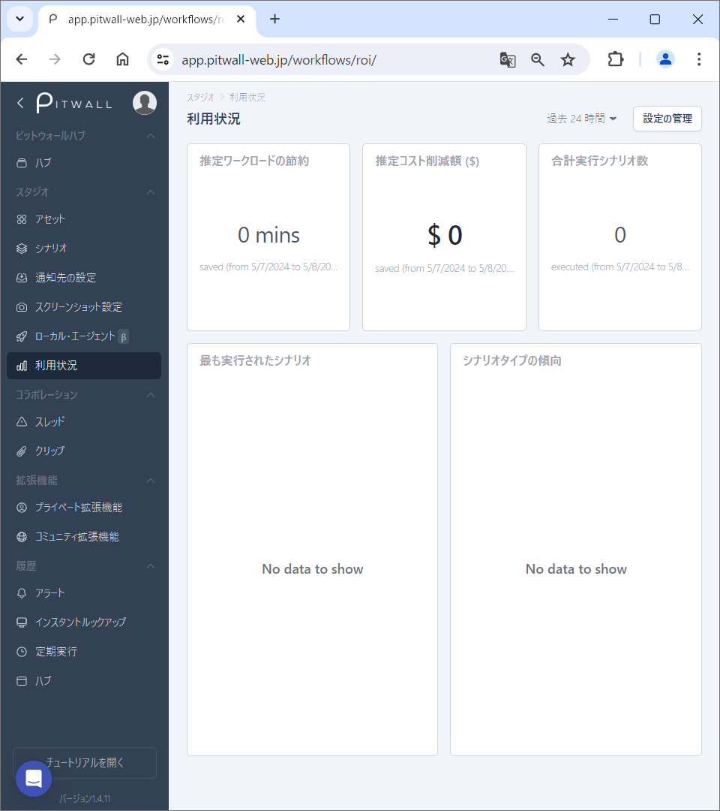
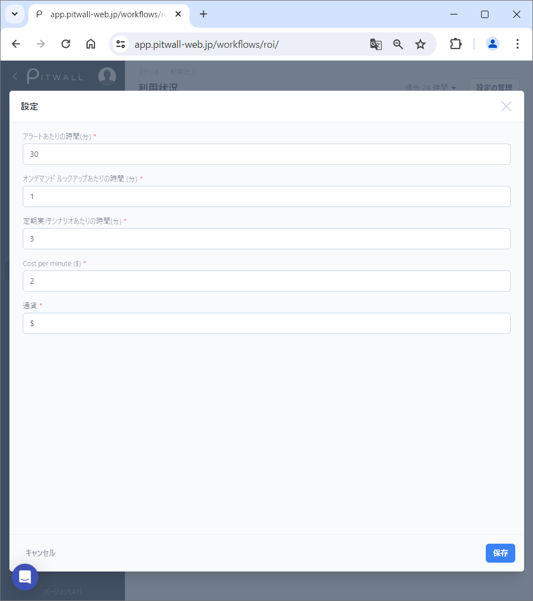

# 利用状況

## 利用状況とは
PITWALLを利用していると様々なデータが蓄積されます。以下のようなデータを見ることができます。

- 推定ワークロードの節約
- 推定節約コスト
- 合計実行シナリオ数
- 最も実行されたシナリオ
- シナリオタイプの傾向

## 使用方法

初期画面はこのような画面になります。

<figure></figure>

### 過去データの表示
画面の右上のプルダウンメニューで、過去データの表示期間を選ぶことができます。

### 設定の管理
「設定の管理」ボタンをクリックするとモーダル画面が表示され、設定の変更ができます。ここに設定する値を元に利用状況のデータが算出されます。

<figure></figure>

- アラートあたりの時間(分)
- オンデマンド ルックアップあたりの時間 (分)
- 定期実行シナリオあたりの時間(分)
- Cost per minute(設定した通貨の記号)
- 通貨:表示させたい通貨の記号 (例:$、￥)
