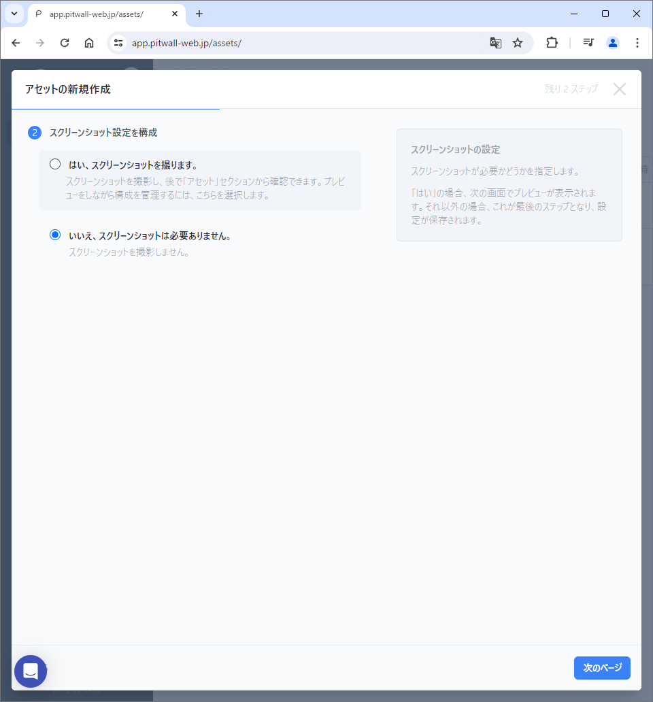
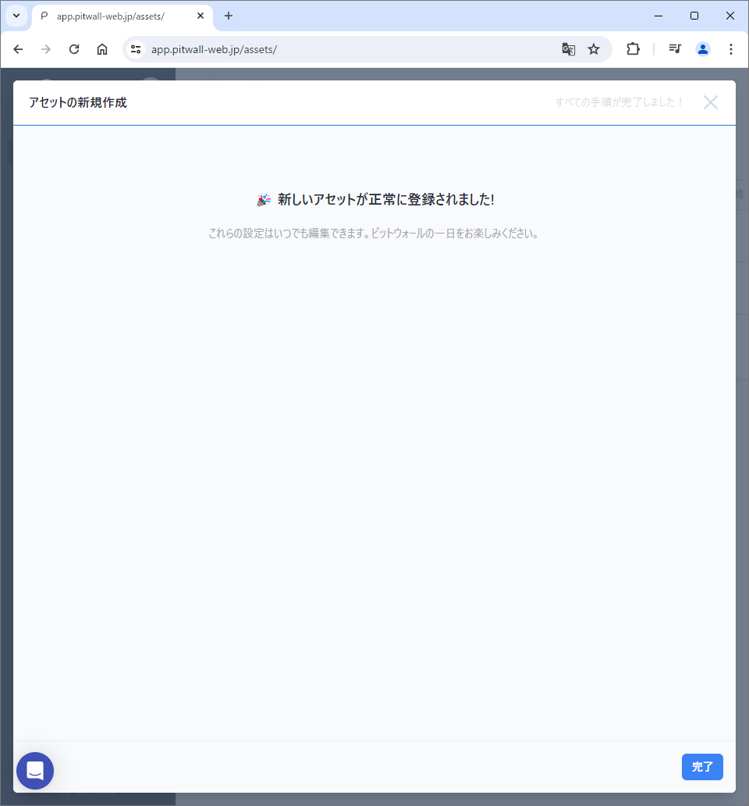

# アセット

## アセットとは
アセットとは、PitWallで利用する各サイト（Webページ、監視ツールなど）へのアクセスと検索条件を事前定義し、登録しておくことができます。Assetをつかうことで、再利用性を高めることができます。

## 使用方法

初期画面
はじめて利用する場合、このような画面になります。

<figure></figure>

### アセットの登録
右上の「アセットの新規作成」ボタンをクリックします。

#### アセット情報の入力
モーダル画面の 「#1 アセット情報の入力」 からAssetの識別情報を登録します。<!--Photo--> 
<figure></figure>

- 名前: このアセットを素早く見つけられるように任意の名前をつけます。
- カテゴリー: 対象アセットをふくむ同種のアセットを仕分けるための任意のカテゴリ名を定義します。（例：Trace, Log, Metricなど）
  - 任意のカテゴリー名を入力後、ポップアップされる「Add *カテゴリー名* ...」をクリックして、カテゴリー名を確定させる必要があります。
  - カテゴリー名を登録した場合、初期画面のヘッダにタブとして表示されます。
- チーム: PitWallを複数のチームで利用する場合や利用シーンが異なるなどの場合に分類をするために利用します。
  - 任意のチーム名を入力後、ポップアップされる「Add *チーム名* ...」をクリックして、チーム名を確定させる必要があります。
- URL: このAssetからアクセスする先のWebサービスのURLを登録します。
- 自動検出されたサービス: URL欄に登録した情報を元に「拡張機能」に登録されているURLからこのAssetに紐づくExtensionがある場合に自動検出します。初期状態では、「コミュニティ拡張機能」に登録されているWebサービスがある場合、自動検出されます。それ以外については、ユーザが個別に「プライベート拡張機能」に登録したモノが利用可能です。

「次のページ」ボタンをクリックします。

### スクリーンショット設定を構成
<!--Photo-->
<figure></figure>

Assetのスクリーンショットを取得するかどうかについて確認します。
下記のいづれかを選択します。

- はい、スクリーンショットを撮ります。
- いいえ、スクリーンショットは必要ありません。

スクリーンショットを取得する場合：

「はい、スクリーンショットを撮ります。」を選択します。

- 「はい、スクリーンショットを撮ります。」を選択します。

- 既存のスクリーンショットオプションを使用
  - 既存のスクリーンショットは、対象のWebサービス向けに設定を作成していない場合、選択できません。
  - 以前に設定している場合、プルダウンメニューに表示されます。
  - プルダウンメニューに表示される設定情報の確認には、[スクリーンショット設定](screenshot-settings.md)から確認することが出来ます。
- スクリーンショットオプションの新規作成

スクリーンショットを取得しない場合：

- 「いいえ、スクリーンショットは必要ありません。」を選択します。

「次のページ」ボタンをクリックします。
スクリーンショットをとらないことを確認する画面が表示されますので、「保存」ボタンをクリックします。
登録完了の画面が表示されアセットの登録完了となります。完了ボタンで初期画面に戻ります。
<!--Photo--> 
<figure></figure>

### スクリーンショット設定の確認
スクリーンショットを取得することにした場合、スクリーンショット設定の確認画面が表示されます。
その場合、以下の項目を設定します。

- 名前：スクリーンショットの設定を見分けられるよう任意の名前をつけます。
- URL：スクリーンショットを取得するWebサービスの画面のURLです。
  - アセット情報の入力画面で入力したURLが自動的に反映されます。
- ブラウザの自動化：<!-- オートメーションについて解説が必要 -->
- 幅、高さ：取得するスクリーンショットのサイズを設定します。
  - WebサービスやWebサイトによっては、情報の幅が広いものや縦のスクロールが長いものなどがありますので、取得する画面のサイズに応じて、設定します。
  - 既定値は、フルHD（1920x1080）です。
- ディレイ：Webサービスによっては、画面表示までに時間がかかることがあります。
  - そのようなWebサービスのために待ち時間を設定することで、スクリーンショットが正しく取得できるようにします。
  - 単位はミリ秒ですので、３秒待ち時間をとるためには、3000ミリ秒とセットします。
- Cookies：対象のURLへアクセスする際にCookiesを利用しているWebサービスがあります。
  - 例）
  - そのようなサービスへのアクセスを保証するためにキーと値のセットを登録しておきます。
- スクリーンショットの検証：スクリーンショット設定の定期的なヘルスチェックを有効にします。
  - この機能により、ブラウザーのスクリーンショットの自動化と Cookie などの認証情報の検証を定期的に監視し、必要に応じてユーザーに通知することができます。

### アセットの確認
作成したアセットは、アイコン、またはアセット名、右サイドの三点リーダ（{photo}）より"Edit this asset"を選択することで、確認や編集をすることが可能です。
<!--Photo--> 
<figure></figure>

### アセットの削除

作成したAssetは、右サイドの三点リーダより"Delete this asset"を選択します。

削除してよい場合、削除ボタンをクリックして確定させます。
<!--Photo--> 
<figure></figure>

## アセット情報の整理
右上のプルダウンメニューから「カテゴリーごとにグループ化」または「チームごとにグループ化」を選択します。
カテゴリーまたは、チーム名で順番を並べ替えることができます。
また、アセット情報の上段にグループ化タブが表示されますので、任意のグループ化タブを選択することで、対象グループのみ表示させることができます。