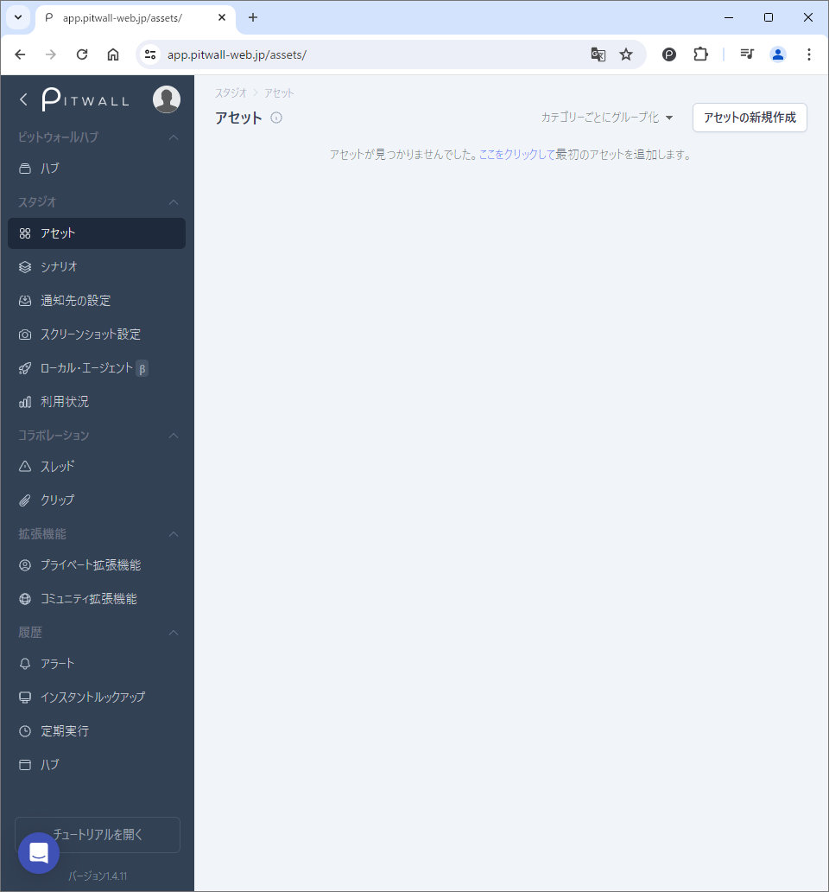
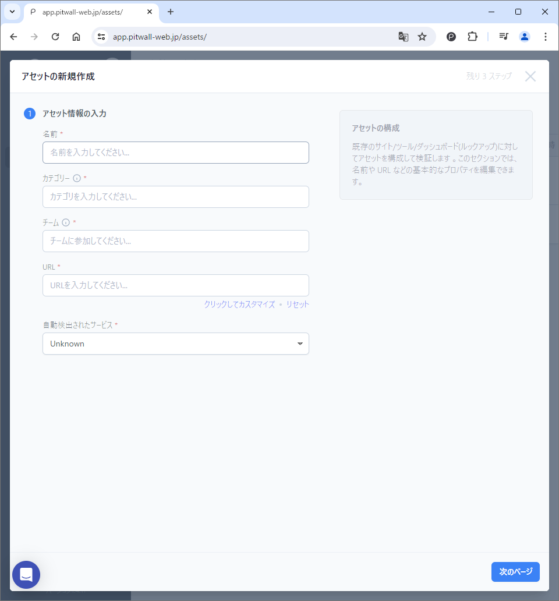
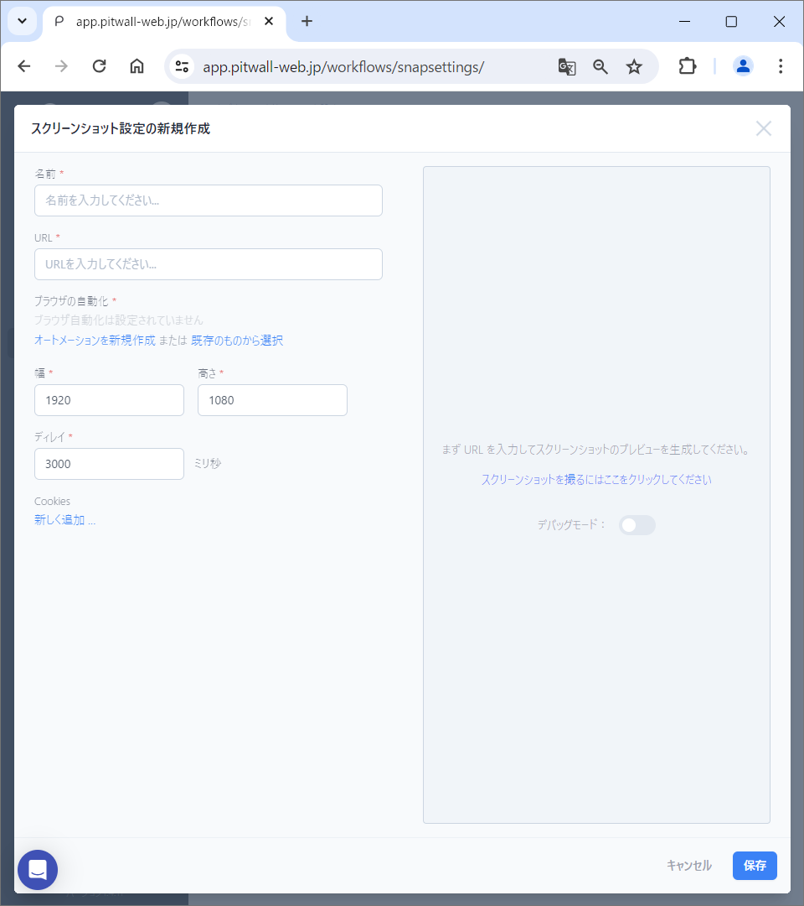
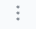
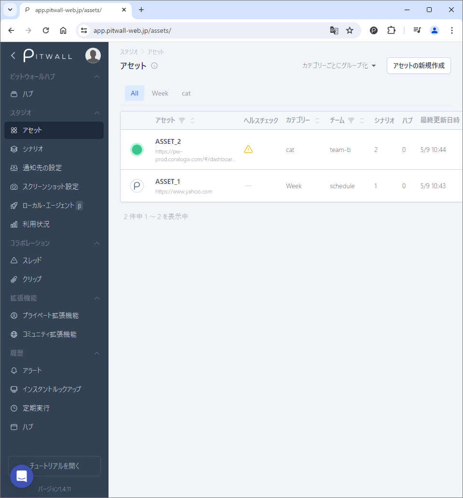
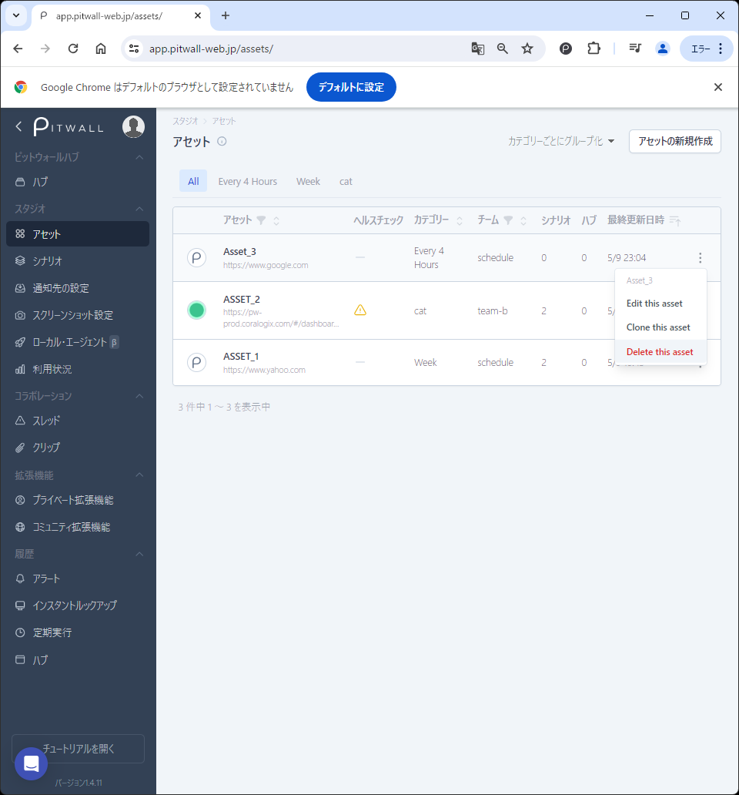

# アセット

## アセットとは
アセットとは、PITWALLで利用する各サイト（Webページ、監視ツールなど）へのアクセスと検索条件を事前定義し、登録しておくことができます。Assetをつかうことで、再利用性を高めることができます。

## 使用方法

初期画面
はじめて利用する場合、このような画面になります。

<figure></figure>

### アセットの登録
右上の「アセットの新規作成」ボタンをクリックします。

#### アセット情報の入力
モーダル画面の 「#1 アセット情報の入力」 からAssetの識別情報を登録します。<!--Photo--> 
<figure></figure>

| 項目                     | 説明  |
| :-                       | :-     |
|名前                      |このアセットを素早く見つけられるように任意の名前をつけます。|
|カテゴリー                |対象アセットを含む同種のアセットを仕分けるための任意のカテゴリ名を定義します。（例：Trace, Log, Metric等） ● 任意のカテゴリー名を入力後、ポップアップされる「Add *カテゴリー名* ...」をクリックして、カテゴリー名を確定させる必要があります。 ● カテゴリー名を登録した場合、初期画面のヘッダにタブとして表示されます。|
|チーム                    |PITWALLを複数のチームで利用する場合や利用シーンが異なる場合に分類をするために利用します。 ● 任意のチーム名を入力後、ポップアップされる「Add *チーム名* ...」をクリックして、チーム名を確定させる必要があります。|
|URL                       |アクセスする先のWebサービスのURLを登録します。|
|自動検出されたサービス    | URL欄に登録した情報と「拡張機能」に登録されているサービスのURLをマッチングさせ、サービスを自動検出します。初期状態では、「コミュニティ拡張機能」に登録されているWebサービスがある場合、自動検出されます。それ以外については、ユーザが個別に「プライベート拡張機能」に登録したモノが利用可能です。|

**「次のページ」** ボタンをクリックします。

### スクリーンショット設定の確認
スクリーンショットを取得することにした場合、スクリーンショット設定の確認画面が表示されます。
その場合、以下の項目を設定します。
<figure></figure>

| 項目                     | 説明  |
| -                        | -     |
|名前                      |スクリーンショットの設定を見分けられるよう任意の名前をつけます。|
|URL                       |スクリーンショットを取得するWebサービスの画面のURLです。 ● アセット情報の入力画面で入力したURLが自動的に反映されます。|
|ブラウザの自動化          |自動化を利用することで、認証が必要なページにアクセスする際に、認証情報を自動で入力することができます。||
|ローカルエージェント      |Local Agent でスクリーンショットを撮ることを有効にします。Local Agent は、ローカル マシン上で実行されるデスクトップ アプリケーションで、ファイアウォールの内側やローカル ネットワーク上にあるWebサービスのスクリーンショットを撮ることができます。詳細については[ローカルエージェント](tutorial-get-started/local-agent.md)のページを参照してください。|
|幅、高さ                  |取得するスクリーンショットのサイズを設定します。 ● WebサービスやWebサイトによっては、情報の幅が広いものや縦のスクロールが長いものなどがありますので、取得する画面のサイズに応じて、設定します。 ● 既定値は、フルHD（1920x1080）です。|
|ディレイ                  |Webサービスによっては、画面表示までに時間がかかることがあります。 ● そのようなWebサービスのために待ち時間を設定することで、スクリーンショットが正しく取得できるようにします。 ● 単位はミリ秒ですので、３秒待ち時間をとるためには、3000ミリ秒とセットします。|
|Cookies                   |対象のURLへアクセスする際にCookiesを利用しているWebサービスがあります。 ● そのようなサービスへのアクセスを保証するためにキーと値のセットを登録しておきます。|
|スクリーンショットの検証  |スクリーンショット設定の定期的なヘルスチェックを有効にします。 ● この機能により、ブラウザーのスクリーンショットの自動化と Cookie などの認証情報の検証を定期的に監視し、必要に応じてユーザーに通知することができます。|

### アセットの確認
作成したアセット、アイコン、またはアセット名は右サイドの三点リーダより"Edit this asset"を選択することで、確認や編集をすることが可能です。
<!--Photo--> 
<figure></figure>

### アセットの削除

作成したアセットは、右サイドの三点リーダより"Delete this asset"を選択します。

削除してよい場合、削除ボタンをクリックして確定させます。
<!--Photo--> 
<figure></figure>

## アセット情報の整理
右上のプルダウンメニューから「カテゴリーごとにグループ化」または「チームごとにグループ化」を選択します。
カテゴリーまたは、チーム名で順番を並べ替えることができます。
また、アセット情報の上段にグループ化タブが表示されますので、任意のグループ化タブを選択することで、対象グループのみ表示させることができます。