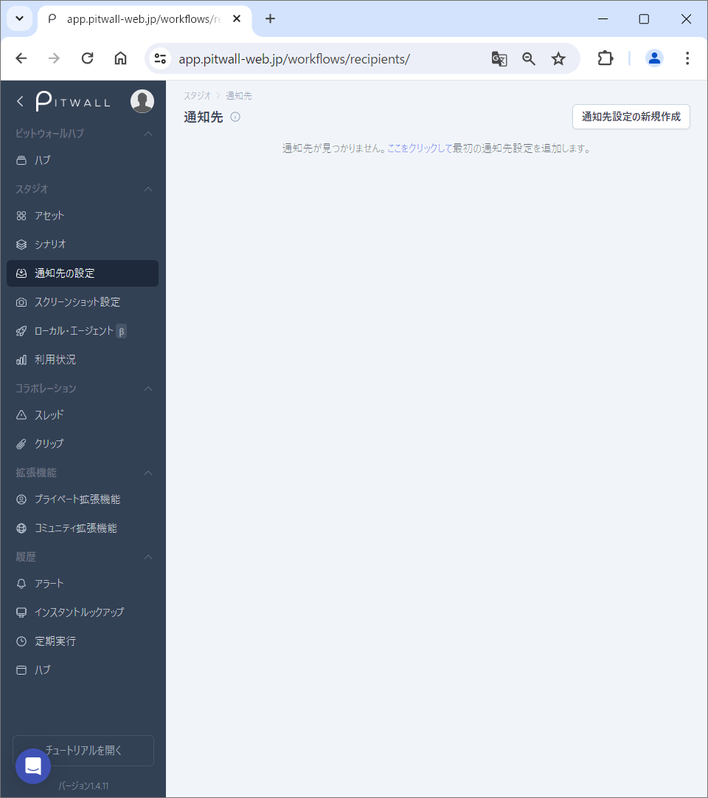
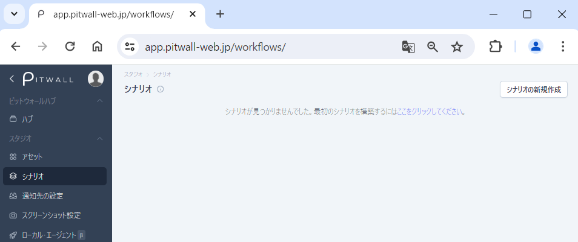
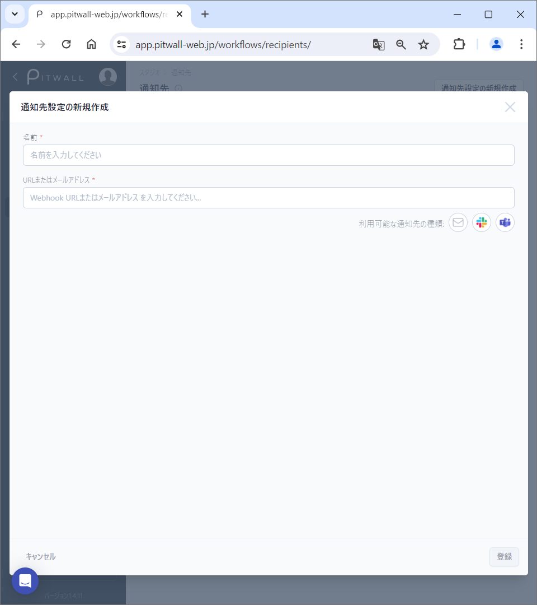
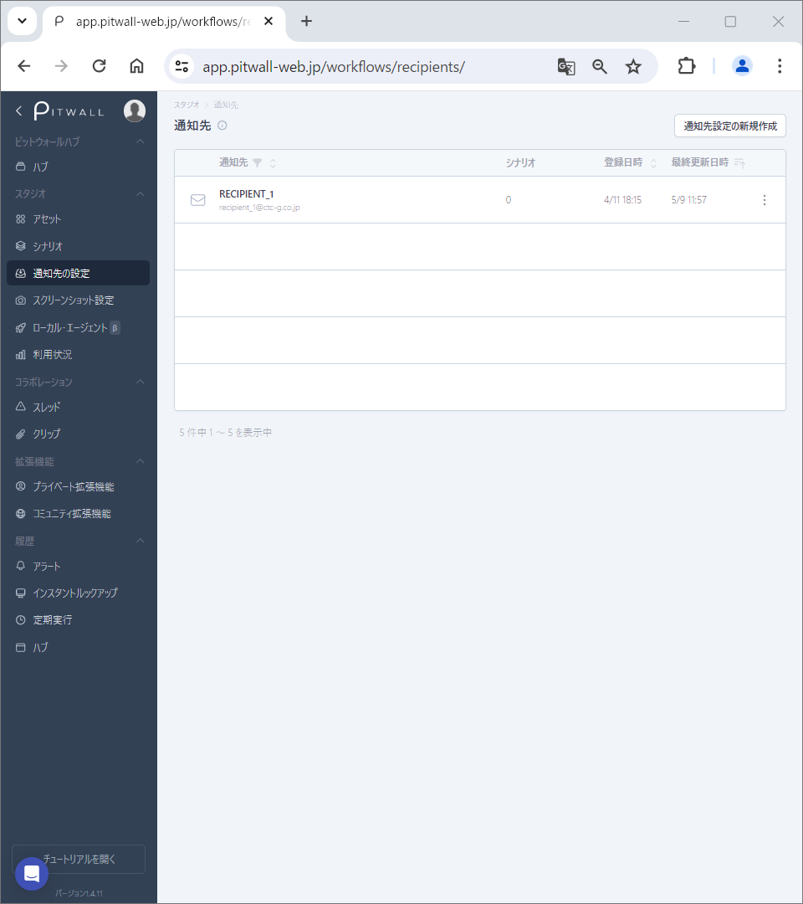

# 通知先の設定

## 通知先の設定とは
通知先の設定をすると、シナリオの実行結果を通知として送信することができます。

## 使用方法

初期画面はこのような画面になります。

<figure></figure>

### 通知先の登録
右上の「通知先設定の新規作成」ボタンをクリックします。

<figure></figure>

モーダル画面の 「通知先設定の新規作成」から通知先情報を登録します。

<figure></figure>

- 名前:通知先に任意の名前が設定できます。（３文字以上必須）
- URLまたはメールアドレス: Webhook URLまたはメールアドレスを入力してください。現在利用可能な通知先はEメール、Slack、Teamsです。

「登録」ボタンをクリックします。

### 通知先登録後の画面
通知先を設定すると登録した通知先が一覧で表示されます。

<figure></figure>

| 項目 | 説明 |
| - | - |
| 通知先 |  通知先名が表示されます。|
| シナリオ | 当該の通知先が設定されているシナリオの数です。 |
| 登録日時 | 通知先を登録した日時です。 |
| 最終更新日時 | 通知先を最後に更新した日時です。 |

### 通知先の編集
通知先を編集するには、通知先名または三点リーダより"Manage recipient"を選択します。選択すると編集画面が表示されます。

### 通知先の削除
通知先を削除するには、三点リーダ より"Delete recipient"を選択します。
削除してよい場合、削除ボタンをクリックして確定させます。
シナリオに通知先が設定されている場合は通知先を削除することができません。先にシナリオから通知先を削除する必要があります。
