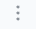

# シナリオ
## シナリオとは
シナリオはPITWALLの対応プロセスを定義し、取得したい情報を並列化、プロセスの終始を可視化することでスムーズな現状把握を支援します。各シナリオはフローチャートになっており、各要素をフローチャート内に設定します。例えば、アラートを起因とするシナリオを新規作成する場合、「トリガー」「ルックアップ」「通知先」等の要素でシナリオが構成され、イベントが発生した際の情報収集先や送信先を設定します。複数のアラートで同じデータルックアップが必要な場合は、それらに対して同じシナリオを使用できます。
## シナリオ
シナリオの新規作成と、作成されているシナリオを一覧で表示します。
<figure></figure>  

### シナリオの新規作成
ボタンをクリックすることで、新規シナリオ作成のページへ遷移します。作成方法については、[シナリオの新規作成](#NewScenarioCreation)手順へ進みます。

### シナリオ一覧
登録されているシナリオは一覧で参照することができます。
| 項目                     | 説明                                                      |
| -                        | -                                                         |
|タイプ                    |シナリオのタイプがアイコンで表示されます。 **アラートシナリオ**： 赤いアイコンで表示されます。 **インスタントルックアップシナリオ**： 青いアイコンで表示されます。 **定期実行シナリオ**： 緑のアイコンで表示されます。 **未設定**： 灰色のアイコンで表示されます。|
|シナリオ                  |シナリオ名が表示されます。シナリオ名の直下に表示される文字列はシナリオIDです。シナリオIDをクリックすることで、シナリオIDを含んだPITWALLエンドポイントURLをコピーできます。|
|トリガー                  |該当のシナリオに設定されたトリガー（サービス）がアイコンで表示されます。シナリオ実行の起因となる要素です。|
|ルックアップ              |ルックアップ対象のアイコンが表示されます。マウスオーバーするとルックアップ対象のサービス名が表示されます。|
|次回の予定                |定期実行で設定されているシナリオについて、次回のシナリオ実行日時が表示されます。|
|最後にトリガーされた日時  |最後に対象のシナリオを実行した日時が表示されます。|
|最終更新日時              |シナリオの設定が最後に更新された日時が表示されます。|

### シナリオ毎のメニュー
シナリオの三点リーダーをクリックすることで、そのシナリオ毎に実行できるメニューを表示します。
<figure></figure>

| 項目                     | 説明                                                      |
| -                        | -                                                         |
|シナリオを管理            |シナリオの編集ページへ遷移します。|
|シナリオを実行            |設定されたシナリオを手動で実行します。|
|シナリオをクローンする    |シナリオのコピーを作成します。クローンされたシナリオはシナリオ名の後ろに「Copy」という文字列が付与されます。|
|履歴を見る                |シナリオが実行された履歴（アクティビティログ）を確認することができます。|
|シナリオを削除する        |シナリオを削除します。一度削除されたシナリオは復元するこができません。|

## シナリオの新規作成
「シナリオの新規作成」ボタンをクリックすると、モーダル画面が表示されます。下記の４つの項目を入力して保存ボタンを押してください。全て入力必須項目となります。
<figure></figure>

| 項目                     | 説明                                                      |
| -                        | -   |
|シナリオタイトル          |シナリオに任意の名前つけます。|
|概要                      |シナリオの概要を入力します。シナリオの概要は１０文字以上を必ず入力してください。|
|シナリオタイプ            |3種類のタイプ（アラート、インスタントルックアップ、定期実行）から、１つ選択します。  **アラート**：アラートを起因とするサイトやツールの分析をします。  **インスタントルックアップ**：ブラウザーの拡張機能を利用し、キーワードにもとづいてオンデマンドでサイトやツールの分析をします。  **定期実行**：定期的にサイトやツールの分析をします。|
|設定方法                  |**ウィザード**：ガイダンスに従って、シナリオを設定します。   **ゼロから構築**：シナリオの各要素を手動で設定します。|

## シナリオフローチャート
<figure></figure>

「ゼロから構築」でシナリオの新規作成を保存すると、無地のキャンバスが表示されます。シナリオの設定に関しては、シナリオタイプごとの設定方法に進んでください。
- シナリオ設定の管理：キャンバス中央の歯車マークをクリックすると、「シナリオ設定の管理」というモーダルページが表示されます。表示されたモーダル画面で、シナリオタイトルと概要を編集します。
- ID：フローチャートの左上に表示されている文字列はシナリオのIDです。シナリオIDをクリックすることで、シナリオIDを含んだPITWALLエンドポイントURLをコピーできます。
- 最終更新者：シナリオを最後に編集したアカウントと編集された時間を表示します。
