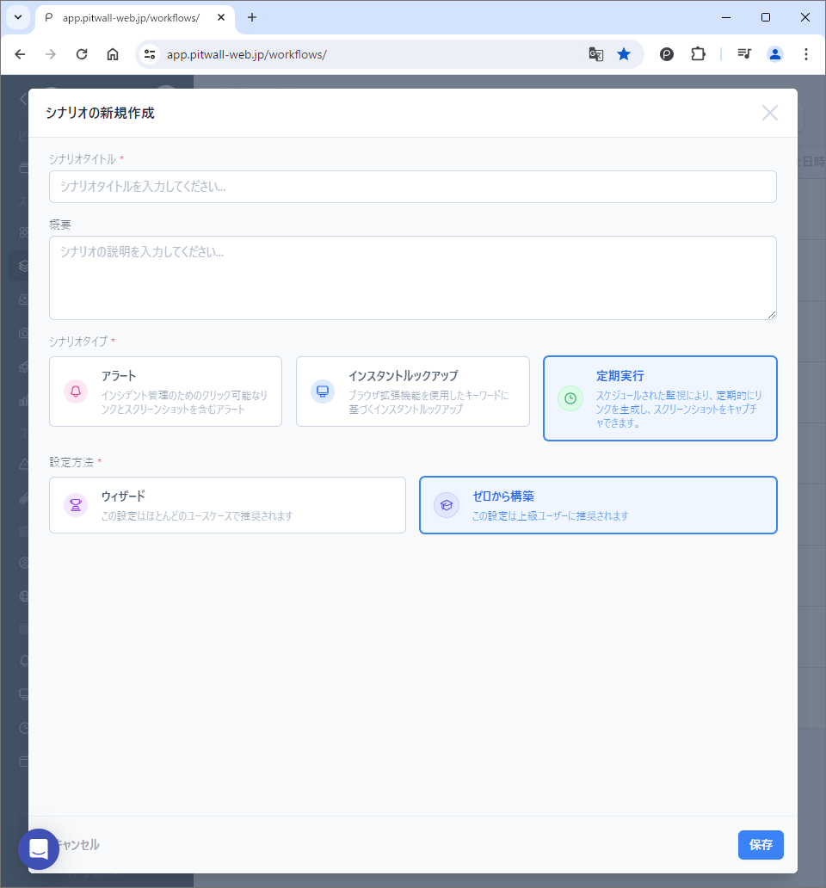

# 定期実行シナリオ
定期実行シナリオを作成することで、定期的なアセットの監視が可能となります。  
以下の手順は、「ゼロから構築」を選択した場合のシナリオ作成手順です。<figure></figure>

## トリガー設定
「トリガーを設定」ボタンをクリックし、シナリオを実行するトリガー（きっかけ）を定義します。定期実行の場合は、シナリオを実行する時間間隔を設定します。<figure></figure>

| 項目                           | 説明  |
|:---                            | :--   |
|タイトル                        |トリガーに任意の名前を付けます。|
|タイプ                          |インスタントルックアップを選択します。|
|このシナリオを有効にしますか？  |トグルを動かして、有効化します。|
|Cronスケジュール式              |定期実行時間をLinuxのCron書式で指定します。テキストボックス後部のコントロールアイコンをクリックすると、ポップアップウィンドウが表示されますので、定期実行スケジュールを指定して、Create Cronボタンで保存します。設定方法は下記の「Cron設定方法」を参照してください。|
|次回の予定は                    |マウスオーバーすると、設定したCron設定の次回以降の実行日時が表示されます。|
|タイムゾーン                    |設定したタイムゾーンをもとに、シナリオが実行されます。|
|相関キーと値                    |定期実行シナリオでルックアップする際に使用するキーと値を設定します。 ●Key：キーを入力します。 ●値：値を入力します。|

### Cron設定方法
<figure></figure>

| 項目               | 説明  |
|:---                | :--   |
|間隔指定            |時間間隔のみでシナリオを設定する場合は、「間隔」のラジオボタンをクリックし、プルダウンリストからシナリオ実行の時間間隔を指定します。
|日時指定            |シナリオを実行する日時を指定します。右側のラジオボタンをクリックしてシナリオを実行する日時を指定します。  **一日の時間**：日次でシナリオの実行時間を指定します。２４時間表記で、実行したい時間の数字を入力します。複数回実行する場合は、コンマで区切って記載します。毎日午前２時と午後２時に実行したい場合は、「2,14」と入力します。      **月の日数**：月次でシナリオの実行日時を指定します。 ●次の時間に実行：２４時間表記で、実行したい時間の数字を入力します。複数回実行する場合は、コンマで区切って記載します。 ●月の特定の日に実行：実行したい日にちを数字で記載します。毎月、１日と１２日に実行したい場合は「１,１２」と記載します。複数回実行する場合は、コンマで区切って記載します。   **曜日**：週次でシナリオ実行日時を指定します。 ●次の時間に実行：２４時間表記で、実行したい時間の数字を入力します。複数回実行する場合は、コンマで区切って記載します。 ●週の曜日に実行：実行する曜日を指定します。曜日は複数設定することもできます。
|Enable manual edit  |クリックすることで、定期実行のCron書式をテキストボックスに手動で入力することができます。

## ルックアップ設定
「ルックアップの新規作成」をクリックして、イベント発生時に取得するデータ（ダッシュボード、ツール、コンソール等）を定義します。シナリオの主要な部分です。下記の項目を登録して、保存ボタンをクリックします。<figure></figure>
### 設定
| 項目                     | 説明  |
|:---                      | :--   |
|メソッドを設定            |ルックアップ方法を設定します。ルックアップ対象をアセット登録している場合は、プルダウンリストからアセットを選択することで、アセットに登録してある方法でアクセスをします。
|タイトル                  |ルックアップ設定に任意の名前を付けます。
|ルックアップグループ      |ルックアップグループを選択します。
|ルックアップグループ追加  |クリックすることで、ルックアップ対象をグループ化することができます。「シナリオ設定の管理」のモーダル画面が表示されたら、「ルックアップグループ」タブで、新規のルックアップグループ名を入力して、保存ボタンをクリックしてください。
|URL                       |ルックアップしたいデータ（ダッシュボード、ビュー、コンソール等）のURLを入力します。
|クリックしてカスタマイズ  |ルックアップ対象のURLの一部をパラメータ化（変数化）します。クリックをすると、「URLのカスタマイズ」というモーダル画面が表示されます。カスタマイズはURLの一部を変数として認識させることで、汎用性を高めます。
|自動検出されたサービス    |URL欄に記入されたURLから自動検出されたサービスを表示します。対象サイトを自動的に検知しなかった場合でも、機能的な影響はありません。ブラウザの拡張機能をインストールすることで、視覚的な補助（シナリオ内のアイコン等）を追加することができます。
|接続元（ソース）          |トリガー名が表示されます。
|エキスパートノート        |作成した専門家のコメント（エキスパートノート）を割り当てることができます。
  
### URLのカスタマイズ
「URLのカスタマイズ」をクリックすると下記のようなモーダル画面が表示されます。<figure></figure>
モーダル画面の左ペインにカスタマイズしたいURLを貼り付けます。カスタマイズしたいパラメーターをマウスでハイライトして、キーを選択します。トリガー設定時に作成したカスタムキーを設定することも可能です。  
  
右ペインの設定パネルから設定することも可能です。
- 時間パラメータ：設定された時間パラメータが表示されます。
    - 新しい時間パラメータを追加します：クリックすると、新規で時間パラメータの設定ができます。
        - 時間パラメータの設定：URLの中で、認識させたい時間フォーマットを選択します。フォーマットを選択すると正規表現が下部に表示されます。任意でラベルを入力したら、「今すぐ追加」ボタンをクリックして保存します。
    - 時間オフセット：チェックボックスを入れて有効化します。時間を設定することで、時間範囲を決めることができます。
- オプションパラメータ：設定されたオプションパラメータが表示されます。
    - 新しいオプションのパラメータを追加します：時間以外の文字列をパラメータ化する際に利用します。
        - オプションパラメータの設定：追加するパラメータを設定し、保存します。
            - 上部のテキストボックスにパラメータ化したい文字列をURLからコピーして、ペーストします。
            - 下部のテキストボックスにて、ペイロードのパラメータを選択します。
## 通知先設定
「通知先の管理」をクリックし、ルックアップで収集された情報を通知する先を定義します。Pitwallに登録されている通知先を設定する場合は、入力欄から通知先を検索して選択します。通知先を新規登録して設定したい場合は、名前と通知先を登録して設定します。通知先は複数設定が可能です。通知先として、E-mail、Slack、Teamsを設定が可能です。詳しくは[通知先設定](tutorial-get-started/studio/recipient-settings.md)マニュアルを参照してください。
<figure></figure>