# ブラウザの自動化 
ブラウザを自動化させることによって、ユーザが行うブラウザ操作をシミュレートし、自動的にブラウザ操作とスクリーンショット取得を行う事が出来ます。
例えばユーザネームとパスワードが必要なサイトで自動的にユーザネームとパスワードを入力し、ログイン後のスクリーンショット取得したい場合や、
検索サイトで自動的に検索ワードを入力、クリックを押下し、画面遷移した後のスクリーンショットを取得したい場合、ブラウザ自動化機能が役立ちます。

## オートメーションを新規作成
ブラウザを自動化させ、スクリーンショットを取得するにあたって、オートメーションの新規作成を行います。
以下、ブラウザを自動化させ、ユーザが行うブラウザの操作をシミュレートし、スクリーンショットを取得する場合の例になります。

オートメーションを新規作成をクリック。モーダル画面の「スクリーンショットフローの更新」で以下のようにスクリーンショットフローを設定します。フローを作成中にプレビューしたい場合は、画面右の「このフローをプレビューする」ボタンを押下することで、プレビュー出来ます。




PITWALLのログイン画面にてユーザーネームとパスワードを入力してログイン後のスクリーンショットを取得する場合。

**ステップ１: URLへアクセスする。**
   
1. 「機能」を「Go to(特定のページに移動する)」に設定する。
2. 「引数」を「Built-in(組み込みから選ぶ)」に設定する。   
3. 「組み込み変数」を「URL(生成されたURLを使用する)」に設定する。
4. 「完了」ボタンを押下。

<figure>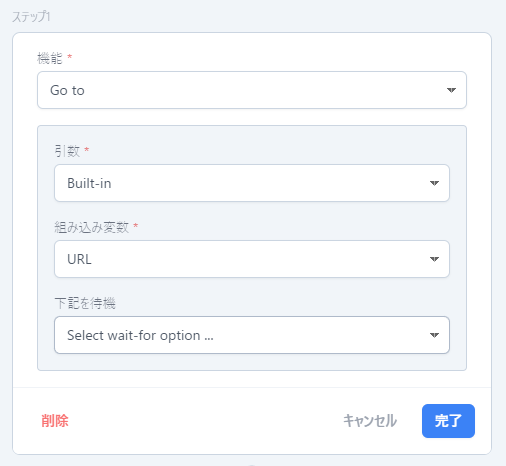</figure>

**ステップ２: URL遷移後のEmail欄にEmailアドレスを入力する。**

1. 「機能」を「Type(ユーザーの入力アクティビティをシミュレートする)」に設定する。
2. 「引数」を「Selector(CSSセレクター)」に設定する。
3. 「値」を`#email-address`に設定する。[※「値」の取得方法は以下参照。](./#「値」の取得方法) 
4. 「下記を待機」を「Wait until(あるイベントが起こるまで待つ)」に設定する。
5. 「ライフサイクル」を「Network Idle 2(ネットワークアイドル2)」に設定する。  
6. 「引数」を「Built-in(組み込みから選ぶ)」に設定する。
7. 「組み込み変数」を「Username(スクリーンショット設定で設定します)」に設定する。
8. 「完了」ボタンを押下。

#### 「値」の取得方法
-  PITWALLのログインページを開き、Eメール欄にて右クリックし、「検証」を選択。<figure>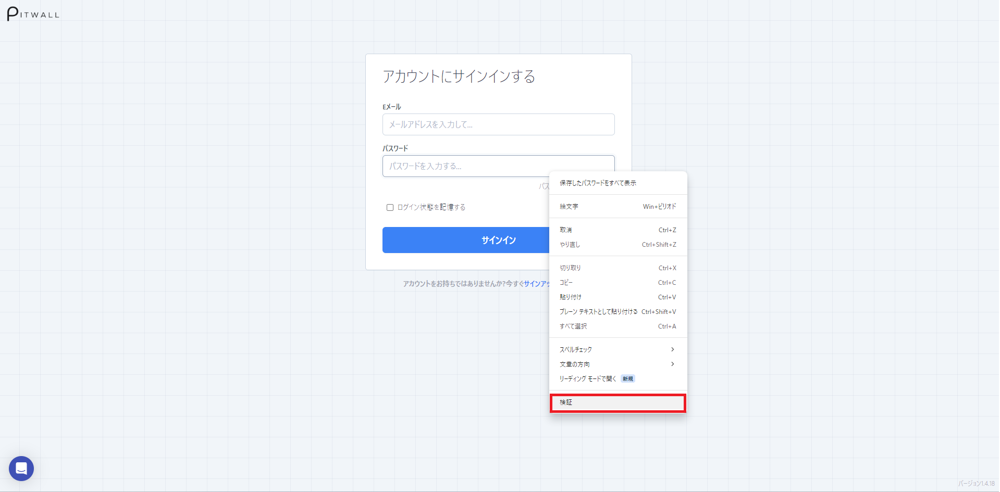</figure>

- devtoolsのelementsタブのハイライトされている箇所を右クリックし、Copy Selectorを選択。<figure>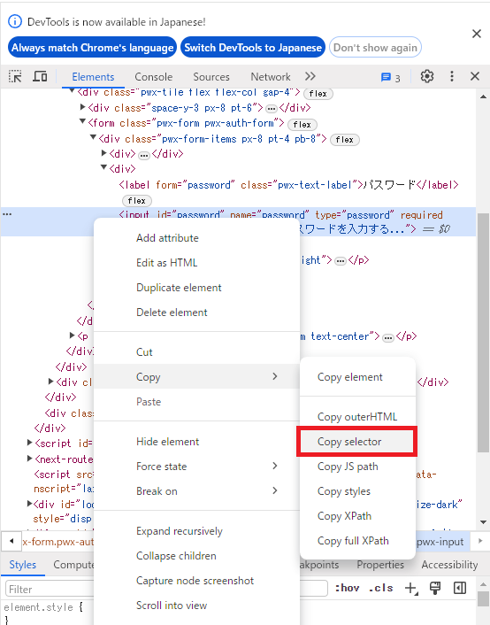</figure>

- 「値」の欄にCopy Selectorで選択したものをペーストする。(ペーストすると今回の場合、`#email-address`になります)。<figure>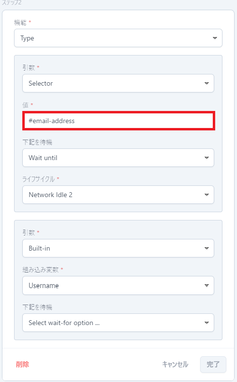</figure>

**ステップ３: URL遷移後のPassword欄にPasswordを入力する。**

1. 「機能」を「Type(ユーザーの入力アクティビティをシミュレートする)」に設定する。
2. 「引数」を「Selector(CSSセレクター)」に設定する。
3. 「値」を`#password`に設定する。[※「値」の取得方法は以下参照。](./#「値」の取得方法) 
4. 「下記を待機」を「Wait until(あるイベントが起こるまで待つ)」に設定する。        
5. 「ライフサイクル」を「Network Idle 2(ネットワークアイドル2)」に設定する。        
6. 「引数」を「Built-in(組み込みから選ぶ)」に設定する。       
7. 「組み込み変数」を「Password(スクリーンショット設定で設定します)」に設定する。        
8. 「完了」ボタンを押下。

  
#### 「値」の取得方法
- PITWALLのログインページを開き、パスワード欄にて右クリックし、「検証」を選択。
<figure></figure>

- devtoolsのelementsタブのハイライトされている箇所を右クリックし、Copy Selectorを選択。
<figure>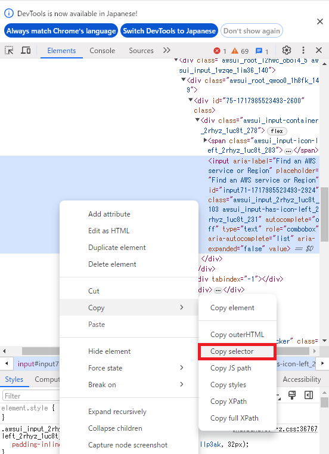</figure>

- 「値」の欄にCopy Selectorで選択したものをペーストする。(ペーストすると今回の場合、`#password`になります)。
<figure>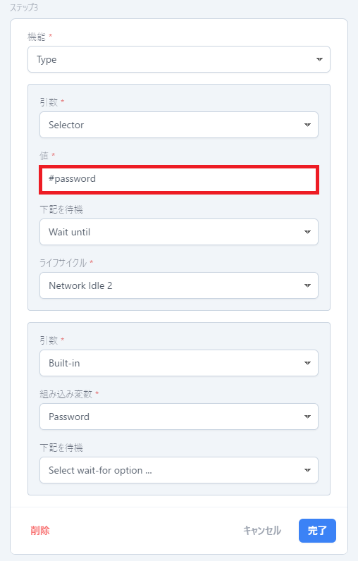</figure>

**ステップ４: サインインボタンを押下する。**

1. 「機能」を「Click(ユーザーのクリックアクティビティをシミュレートする)」に設定する。
2. 「引数」を「Selector(CSSセレクター)」に設定する。
3. 「値」を`#__next > div.relative.w-full.h-screen.flex.flex-col.align-center.justify-center.pwx-auth-bg-color > div.flex.grow.pt-8.pb-16.items-start.justify-center.gap-2.overflow-scroll > div > div > form > div > div.space-y-6 > div > button`に設定する。[※「値」の取得方法は以下参照。](./#「値」の取得方法) 
4. 「下記を待機」を「Wait until(あるイベントが起こるまで待つ)」に設定する。   
5. 「ライフサイクル」を「Network Idle 2(ネットワークアイドル2)」に設定する。    
6. 「完了」ボタンを押下。

#### 「値」の取得方法
- PITWALLのログインページを開き、サインインボタン上で右クリックし、「検証」を選択。
<figure>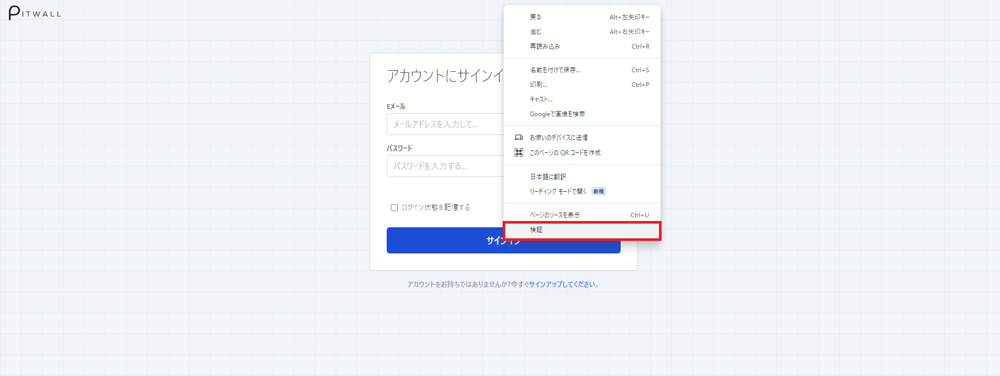</figure>

- devtoolsのelementsタブのハイライトされている箇所を右クリックし、Copy Selectorを選択。
<figure>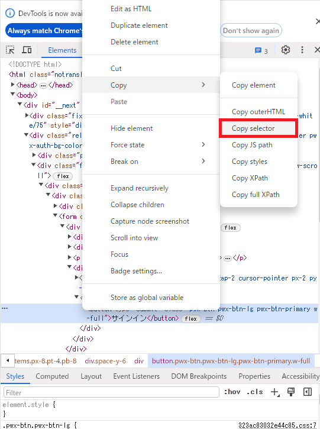</figure>

- 「値」の欄にCopy Selectorで選択したものをペーストする。(ペーストすると今回の場合、`#__next > div.relative.w-full.h-screen.flex.flex-col.align-center.justify-center.pwx-auth-bg-color > div.flex.grow.pt-8.pb-16.items-start.justify-center.gap-2.overflow-scroll > div > div > form > div > div.space-y-6 > div > button`になります)。

<figure>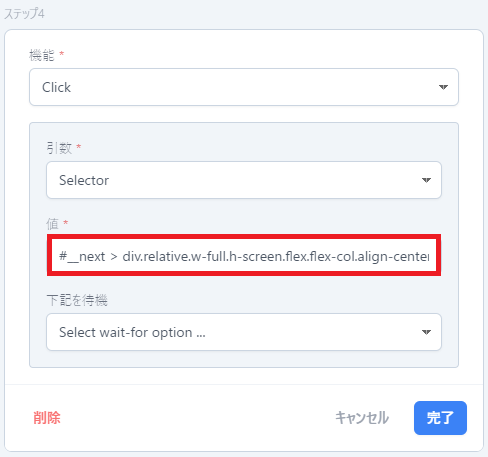</figure>

※「スクリーンショットフローのプレビュー」のURL欄にPITWALLのURL、ユーザー名欄にPITWALLのEメール、パスワード欄にPITWALLのパスワードを入力してください。




AWS Health Dashboard (https://health.aws.amazon.com/health/status) にてサービス (Amazon Route 53) を検索、Enterを押し、スクリーンショットを取得する場合。

**ステップ１: URLへアクセスする。**

1. 「機能」を「Go to(特定のページに移動する)」に設定する。
2. 「引数」を「Built-in(組み込みから選ぶ)」に設定する。
3. 「組み込み変数」を「URL(生成されたURLを使用する)」に設定する。
4. 「下記を待機」を「Wait until(あるイベントが起こるまで待つ)」に設定する。
5. 「ライフサイクル」を「Network Idle ２(ネットワークアイドル２)」に設定する。
6. 「完了」ボタンを押下。
<figure>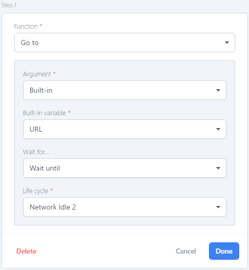</figure>

**ステップ２: URL遷移後の検索欄に検索したいサービスもしくはリージョンを入力する。**

1. 「機能」を「Type(ユーザーの入力アクティビティをシミュレートする)」に設定する。
2. 「引数」を「XPath(XML パス言語)」に設定する。 
3. 「値」を`/html/body/div[2]/div/div[2]/div/div/main/div/div[2]/div[2]/div/div/div[1]/div[2]/div[2]/div[2]/div[1]/div/div[2]/div/div/div[1]/div/div[1]/div/div/div/div[1]/div/input`に設定する。[※「値」の取得方法は以下参照。](./#「値」の取得方法)  
4. 「下記を待機」を「Wait until(あるイベントが起こるまで待つ)」に設定する。    
5. 「ライフサイクル」を「Network Idle ２(ネットワークアイドル２)」に設定する。     
6. 「引数」を「Static(静的な値)」に設定する。   
7. 「値」を「Service = Amazon Route 53」に設定する。    
8. 「完了」ボタンを押下。
<figure>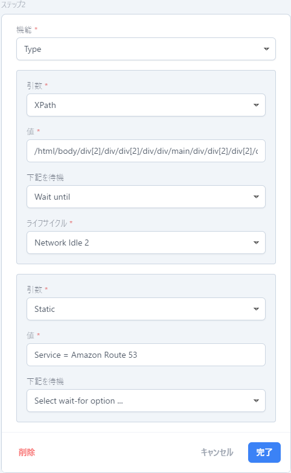</figure>

#### 「値」の取得方法
- AWS Health Dashboard (https://health.aws.amazon.com/health/status) を開き、検索欄にて右クリックし、「検証」を選択。
<figure>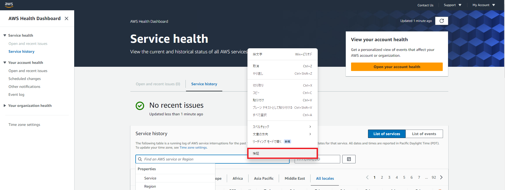</figure>

- devtoolsのelementsタブのハイライトされている箇所を右クリックし、Copy full XPathを選択。
<figure></figure>

- 「値」の欄にCopy full XPathで選択したものをペーストする。(ペーストすると今回の場合、`/html/body/div[2]/div/div[2]/div/div/main/div/div[2]/div[2]/div/div/div[1]/div[2]/div[2]/div[2]/div[1]/div/div[2]/div/div/div[1]/div/div[1]/div/div/div/div[1]/div/input`になります)。

<figure>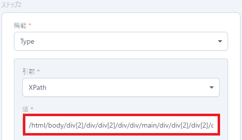</figure>
      

**ステップ３: Enterキーを押下する**

1. 「機能」を「Enter(Enterキーの押下をシミュレートする)」に設定する。
2. 「完了」ボタンを押下。

※「スクリーンショットフローのプレビュー」のURL欄にAWS Health DashboardのURL( (https://health.aws.amazon.com/health/status) )を入力してください。




| フローに設定できる機能          | 説明                    |
| -                | -                       |
| Go to      | 特定のページに移動する        |
| Session Manager  | ターゲットホストへの安全なトンネルを確立する              | 
| Click | ユーザーのクリックアクテイビテイをシミュレートする |
| Type       | ユーザーの入力アクテイビテイをシミュレートする    |
| Wait for selector  | CSSセレクターを待つ             | 
| Wait for navigation | ページナビゲーションを待つ |
| Wait for timeout       | タイムアウトを待つ     |
| Enter | Enterキーの押下をシミュレートする |
| Go to href    | タグのhref属性で指定されたURLに移動します    |
| Wait and click | セレクタを待ってクリックします               | 
| Wait and type | セレクタを待って入力します |
| Sleep       | 待ち時間を指定（ミリ秒）    |

| 機能の引数         | 説明                    |
| -                | -                       |
| Selector      | CSSセレクター      |
| XPath  | XPath (XML パス言語)             | 
| Static | 静的な値　|
| Built in     | 組み込みから選ぶ   |
| Screenshot option extension   | スクリーンショットオプションで構成されます

| 組み込み変数         | 説明                       |
| -                | -                          |
| URL    | 生成されたURLを使用する      |
| Username  | スクリーンショット設定で設定します                | 
| Password | スクリーンショット設定で設定します 　|

| 下記を待機        | 説明                    |
| -                | -                       |
| Timeout     | タイムアウトを待つ      |
| Wait until  | あるイベントが起こるまで待つ             | 

| ライフサイクル        | 説明                    |
| -                | -                       |
| Load     | 負荷      |
| Dom Content Loaded  | あるイベントが起こるまで待つ (画像やスタイルシートなどの外部リソースの完全なページの読み込みを待たずに利用するオプション)   | 
| Network Idle 0     | ネットワークアイドル 0 (ネットワーク接続が 0 個以下になるまで、少なくとも 500 ミリ秒待機します。)|
| Network Idle 2  | ネットワークアイドル 2 (ネットワーク接続が 2 つ以下になるまで、少なくとも 500 ミリ秒待機します。)            | 
