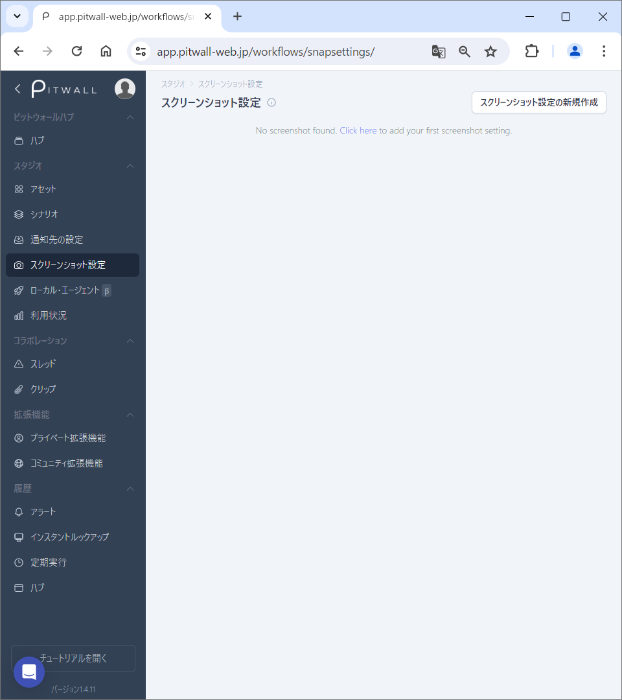
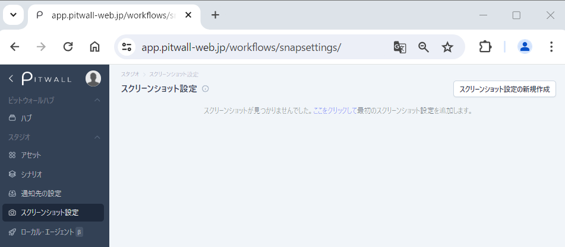

# スクリーンショット設定

## スクリーンショットとは
スクリーンショットを設定することで、シナリオが発動した際に設定されているサイトやツールのスクリーンショットを取得できます。

## 使用方法

初期画面はこのような画面になります。

<figure></figure>

### スクリーンショット設定の登録
右上の「スクリーンショット設定の新規作成」ボタンをクリックします。

<figure></figure>

#### スクリーンショット設定の入力
モーダル画面の 「スクリーンショット設定の新規作成」 からスクリーンショット設定の情報を登録します。

<figure></figure>

| 項目 | 説明 |
| - | - |
| 名前 | 任意のスクリーンショット名を入力します。 |
| URL | 取得したいスクリーンショットのURLを入力します。 |
| ブラウザの自動化 | ブラウザの自動化を利用することで、認証情報を自動で入力させることができます。 |
| 幅と高さ | 取得したいスクリーンショットの幅と高さを入力します。デフォルト値として1920 X 1080が入っています。 |
| ディレイ | スクリーンショットが取得されるまでの待機時間を入力します。デフォルト値として3000ミリ秒（３秒）が入っています。|
| Cookies | Keyと値にはクッキーのKey-Valueを入力してください。複数設定する場合は「新しく追加」をクリックしてください。|
| スクリーンショットプレビュー | 取得したいスクリーンショットのプレビューを見ることができます。スクリーンショットを撮るには、画面右の「スクリーンショットを撮るにはここをクリックしてください」をクリックしてください。 |

「保存」ボタンをクリックして設定を完了します。